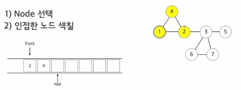
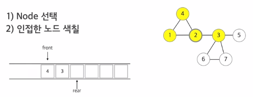
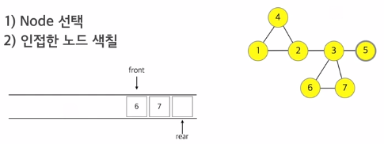
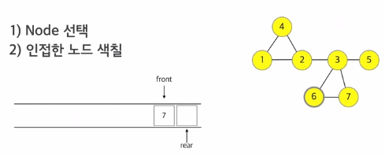

# L19


1. ## BFS


#### 너비우선탐색

##### 그래프 순회

깊이우선탐색(Depth First Search) : 스택을 이용하여 그래프를 순회하는 방법

너비우선탐색(Breadth First Search) : 큐를 이용하여 그래프를 순회하는 방법 BFS


#### 너비 우선 탐색의 개념

너비 우선 탐색 (BFS)

* 인접한 노드들을 우선 모두 색칠해 두고 뻗어나간다.

  1) Node 선택

  2) 인접한 노드 색칠


1(시작점)을 색칠하고 1을 큐에 넣은 상태로 시작


시작점을 알기 위해 큐에서 pop 해서 1번이 시작점임을 알게됨


1에서 인접한 노드 보며 방문 안한 노드 큐에 넣음












큐가 비어있으니 너비우선탐색이 끝남

1 -> 2-> 4 -> 3 -> 5 -> 6 -> 7


#### 너비 우선 탐색의 퀴즈


(처음엔 큐를 그려가면서 하는 것이 도움됨)

1 -> 2 -> 4 -> 3 -> 11 -> 9 -> 5 -> 6 -> 8 -> 7 -> 10


#### 너비 우선 탐색의 구현 설계

#### STL QUEUE

#### 너비 우선 탐색의 구현

```c
// 너비우선탐색 (BFS)

//    1 ----- 2 ------- 6
//     \     / \       /
//      \   /   4 --- 5
//       \ /   / \
//        3 - 7 - 8 - 9

// DFS : 1 -> 2 -> 3 -> 7 -> 4 -> 5 -> 6 -> 8 -> 9
// BFS : 1 -> 2 -> 3 -> 4 -> 6 -> 7 -> 5 -> 8 -> 9

// 9 12
// 1 2
// 1 3
// 2 3
// 2 4
// 2 6
// 3 7
// 4 5
// 4 7
// 4 8
// 5 6
// 7 8
// 8 9

#include <cstdio>
#include <vector>
#include <queue>

using namespace std;

const int MAX = 100;

int n, m;  // 정점, 간선
vector <int> myGraph[MAX];

void BFS() {
  // 1. 시작점을 큐에 삽입한다.
  // 2. 시작점을 색칠한다.
  
  // BFS 시작!
  
  // 3. 큐에서 하나를 뺀다. 얘가 우리의 현재 위치이다.
  // 4. 인접한 모든 정점에게 방문했는지 물어보고
  //    방문을 하지 않았다면, 색칠하고 큐에 삽입한다.
  // 5. 모두 완료했다면 다시 3. 으로 돌아간다.
  
  bool check[MAX] = {0,};  // check[x] = true 면 x 가 색칠이 됨
  queue <int> Queue;
  
  // Queue.push(x);  // x 를 큐에 삽입
  // Queue.pop();  // 큐의 맨 앞에 있는 원소를 제거
  // Queue.front();  // 맨 앞에 있는 원소를 반환
  // Queue.empty();  // 비었으면 true 를 반환
  
  Queue.push(1);
  check[1] = true;
  
  while(!Queue.empty()) {
    // 큐가 비어있니?
    // if(Queue.empty() == true) break;
    
    int current = Queue.front();
    Queue.pop();
    
    printf("%d ", current);
    
    for(int i=0; i<myGraph[current].size(); i++) {
      int next = myGraph[current][i];
      // current -- next
      
      if(check[next] == false) {
        check[next] = true;
        Queue.push(next);
      }
    }
  }
  
}

int main() {
  scanf("%d %d", &n, &m);
  
  for(int i=0; i<m; i++) {
    int a, b;
    
    scanf("%d %d", &a, &b);  // a --- BFS
    
    myGraph[a].push_back(b);
    myGraph[b].push_back(a);
  }
  
  BFS();
  
  return 0;
}
```


#### 깊이우선탐색과 너비우선탐색

```c

```


#### 2색칠하기

```c

```


#### 이분그래프판별

```c

```


#### 웜바이러스

```c

```


#### 미로찾기

```c

```


#### 단지번호붙이기

```c

```


#### 이상한계산기

```c

```


#### 전염병

```c

```


#### 목수의미로탈출

```c

```

