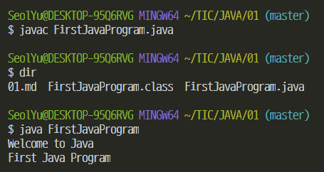

### JDK 다운로드 및 설치

www.oracle.com 에서 JDK 를 다운로드

자바의 기본 도구

- javac.exe 자바 컴파일러 (Java Compiler)
- java.exe 자바 런처 (Java Launcher)

명령프롬프트 상에서 실행

환경 변수 Path - 소프트웨어 경로

### jdk 디렉토리 - bin 디렉토리

변수 이름은 Path 값은 디렉토리

내 컴퓨터 - 속성 - 고급 시스템 설정 - 환경변수

상위 폴더 jdk 경로 복사해서

새 시스템 변수 

JAVA_HOME 

C:\Program Files\Java\jdk-13.0.2

Path 편집 누르고

새로만들기

%JAVA_HOME%\bin

cmd 창에서 java -version

java

javac

`javac FirstJavaProgram.java`

파일 이름

javac가 실행되면서 컴파일함

dir

.class 만들어져있음(컴파일 제대로 됨)

실행할 땐

`java FirstJavaProgram`

.class 생략

java.exe 가 실행되면서 FirstJavaProgram.class 찾아서 실행

