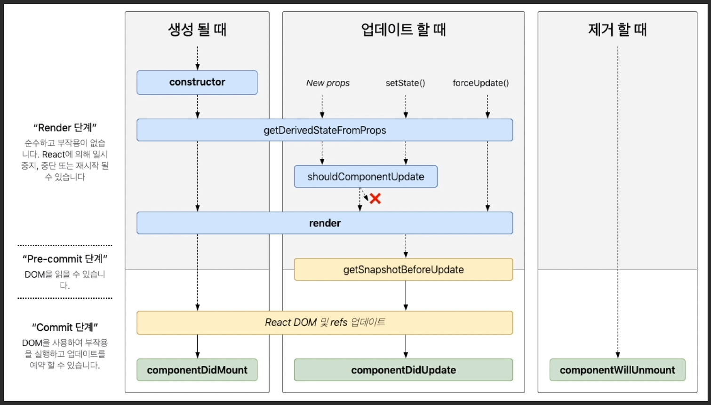

# 마운트

## constructor

## getDerivedStateFromProps

## render

## componentDidMount


### Constructor 생성자 함수

컴포넌트가 처음 만들어질 때 호출되는 함수

```react
constructor(props) {
    super(props);
    console.log("constructor");
}
```


### getDerivedStateFromProps

```react
static getDerivedStateFromProps(nextProps, prevState) {
    console.log("getDerivedStateFromProps");
    if (nextProps.color !== prevState.color) {
        return { color: nextProps.color };
    }
    return null;
}
```


### render

```react
render() {
    return <div>Hello World!</div>
}
```


### componentDidMount

```react
componentDidMount() {
    console.log('컴포넌트가 화면에서 보여지고 있습니다');
}
```


# 업데이트

## getDerivedStateFromProps

## shouldComponentUpdate

## render

## getSnapshotBeforeUpdate

## componentDidUpdate


### getDerivedStateFromProps

```react
static getDerivedStateFromProps(nextProps, prevState) {
    console.log("getDerivedStateFromProps");
    if (nextProps.color !== prevState.color) {
        return { color: nextProps.color };
    }
    return null;
}
```


### shouldComponentUpdate

```react
shouldComponentUpdate(nextProps, nextState) {
    console.log("shouldComponentUpdate", nextProps, nextState);
    // 숫자의 마지막 자리가 4면 리렌더링하지 않습니다
    return nextState.number % 10 !== 4;
}
```


### render

```react
render() {
    return <div>Hello World!</div>
}
```


### getSnapshotBeforeUpdate

```react
getSnapshotBeforeUpdate(prevProps, prevState) {
    console.log("getSnapshotBeforeUpdate");
    if (prevProps.color !== this.props.color) {
        return this.myRef.style.colr;
    }
    return null;
}
```


### componentDidUpdate

```react
componentDidUpdate(prevProps, prevState, snapshot) {
    console.log("componentDidUpdate", prevProps, prevState);
    if (snapshot) {
        console.log("업데이트 되기 직전 색상: ", snapshot);
    }
}
```


# 언마운트

## componentWillUnmount


### componentWillUnmount

```react
componentWillUnmount() {
    console.log('컴포넌트가 사라지기 직전!');
}
```

