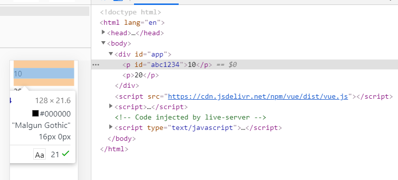
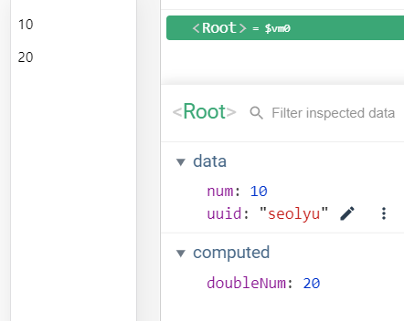

뷰의 템플릿 문법

뷰로 화면을 조작하는 방법. 

* 데이터 바인딩
* 디렉티브


#### 데이터 바인딩

뷰 인스턴스에서 정의한 속성들을 화면에 표시하는 방법

콧수염 괄호(Mustache Tag)

```html
<div>
    {{ message }}
</div>
```

```javascript
new Vue({
    data: {
        message: 'Hello Vue.js'
    }
})
```


#### 디렉티브

뷰로 화면의 요소를 더 쉽게 조작하기 위한 문법 

HTML 태그에서 일반적인 id, class 등 표준 속성을 제외하고 v- 붙는 속성들 => 뷰 디렉티브

```html
<div>
    Hello <span v-if="show">Vue.js</span>
</div>
```

```javascript
new Vue({
    data: {
        show: false
    }
})
```


```html
<div id="app">
    {{ str }}
</div>

<script src="https://cdn.jsdelivr.net/npm/vue/dist/vue.js"></script>
<script>
    new Vue({
        el: '#app',
        data: {
            str: 'hi'
        }
    })
</script>
```


값을 바꿨을 때 바로 화면에 반영되어서 갱신(다시 그려짐)되는 것 -> reactivity

값이 연결되는 구간 - 데이터바인딩


데이터 값에 따라서 바뀌는 값을 정의할 때 computed 속성 활용

```html
<div id="app">
    <p>{{ num }}</p>
    <p>{{ doubleNum }}</p>
</div>

<script src="https://cdn.jsdelivr.net/npm/vue/dist/vue.js"></script>
<script>
    new Vue({
        el: '#app',
        data: {
            num: 10,
        },
        computed: {
            doubleNum: function() {
                return this.num * 2;
            }
        }
    })
</script>
```


#### 뷰 디렉티브와 v-bind

```html
<div id="app">
    <p v-bind:id="uuid" v-bind:class="">{{ num }}</p>
    <!-- 위 내용은 실제 화면에서 아래와 같이 나타남 -->
    <!-- <p id="abc1234">{{ num }}</p> -->
    <p>{{ doubleNum }}</p>
</div>

<script src="https://cdn.jsdelivr.net/npm/vue/dist/vue.js"></script>
<script>
    new Vue({
        el: '#app',
        data: {
            num: 10,
            uuid: 'abc1234',
            name: 'text-blue'
        },
        computed: {
            doubleNum: function() {
                return this.num * 2;
            }
        }
    })
</script>
```







v-bind:id 문법 이용해서 편하게 데이터 조작해서 값 바꾸기 