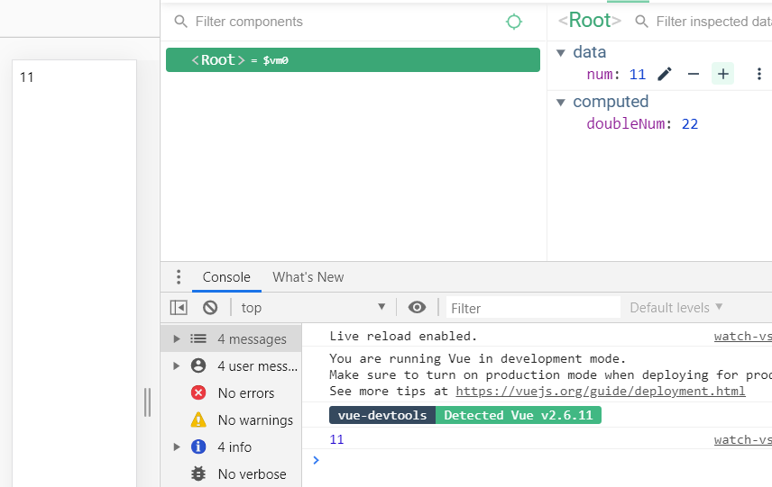

#### watch

```html
<div id="app">
    {{ num }}
    <button v-on:click="addNum">increase</button>
</div>

<script src="https://cdn.jsdelivr.net/npm/vue/dist/vue.js"></script>
<script>
    new Vue({
        el: '#app',
        data: {
            num: 10
        },
        methods: {
            addNum: function() {
                this.num = this.num + 1;
            }
        }
    })
</script>
```


```html
<div id="app">
    {{ num }}
    <button v-on:click="addNum">increase</button>
</div>

<script src="https://cdn.jsdelivr.net/npm/vue/dist/vue.js"></script>
<script>
    new Vue({
        el: '#app',
        data: {
            num: 10
        },
        watch: {
            num: function() {
                this.logText();
            }
        },
        methods: {
            addNum: function() {
                this.num = this.num + 1;
            },
            logText: function() {
                console.log('changed');
            }
        }
    })
</script>
```

watch <- data의 변화에 따라서 특정 로직을 실행할 수 있음

num을 바꿀 떄마다 this.logText() 실행


#### watch 속성 vs computed 속성

```html
<div id="app">
    {{ num }}
</div>

<script src="https://cdn.jsdelivr.net/npm/vue/dist/vue.js"></script>
<script>
    new Vue({
        el: '#app',
        data: {
            num: 10
        },
        computed: {
            doubleNum: function() {
                return this.num * 2;
            }
        },
        watch: {
            num: function(newValue, oldValue) {
                this.fetchUserByNumber(newValue);
            }
        },
        methods: {
            fetchUserByNumber: function(num) {
                console.log(num);
                // axios.get(num);
            }
        }
    });
</script>
```




 [명령적인 `watch` 콜백보다 computed 속성을 사용하는 것이 더 좋습니다](https://kr.vuejs.org/v2/guide/computed.html)

