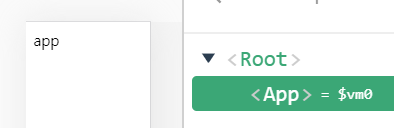
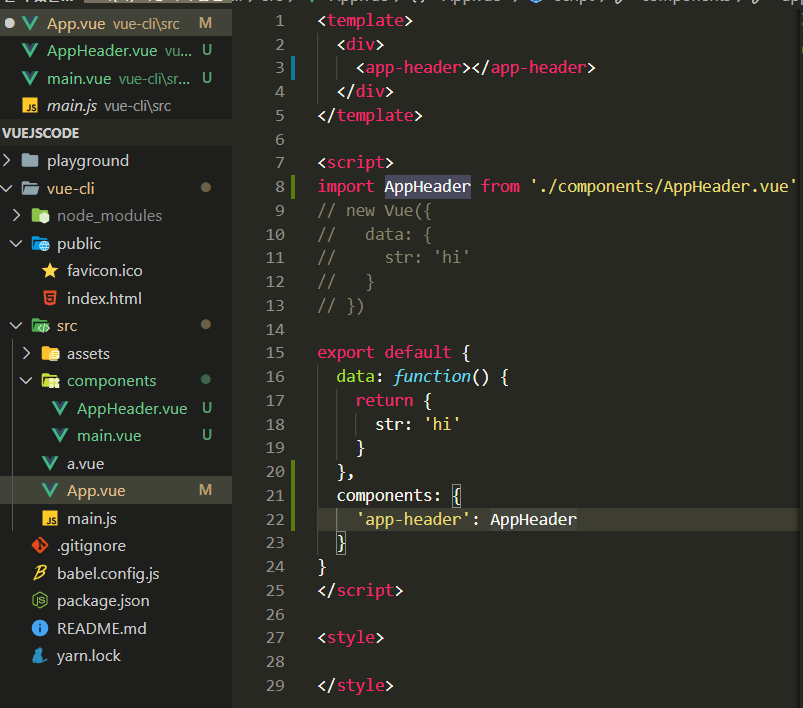
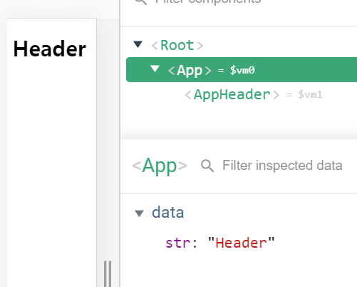
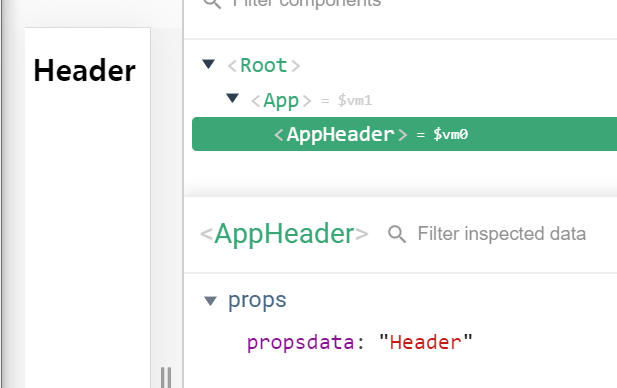

components 폴더 아레 HelloWorld.vue 삭제

App.vue 내용 다 지우기

<template> 속성 HTML element 최상위 레벨에 하나만 있어야함

The template root requires exactly one element.




```vue
<template>
  <div>
    {{ str }}
  </div>
</template>

<script>
// new Vue({
//   data: {
//     str: 'hi'
//   }
// })

export default {
  data: function() {
    return {
      str: 'hi'
    }
  }
}
</script>

<style>

</style>
```


src > components > AppHeader.vue


위와 같이 하면 HTML 표준태그인지 컴포넌트 태그인지 브라우저는 알 길이 없어서

구분할 수 있도록

components 이름은 최소한 두 단어 이상으로 조합(스타일가이드 권고)


import 할 때 .vue 까지 붙여줘야 vscode에서 제공하는 파일 바로가기 깨지지 않고 사용 가능

확장자 붙이기


AppHeader.vue

```vue
<template>
    <header>
        <h1>Header</h1>
    </header>
</template>

<script>
export default {
    
}
</script>

<style>
    
</style>
```




파일에 있는 내용을 변수에 담고 연결

(객체 아닌 파일로 저장)

```vue
// 객체
var AppHeader = {
   template: '<header><h1>Header</h1></header>'
}
```


App 이라는 컴포넌트에서 str이라는 데이터를 propsdata(props 속성 이름)로 내려보냄





