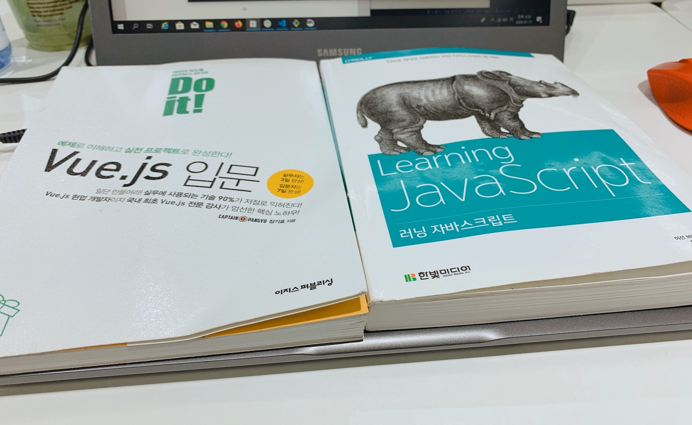
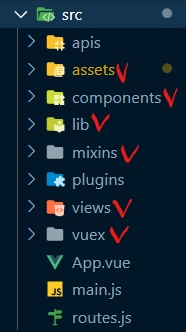
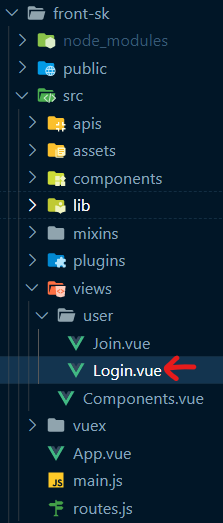
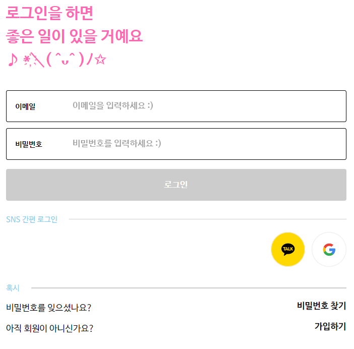

## 웹 큐레이션 SNS

* 인터넷 URL 기반의 공유 SNS
* RSS 또는 Google Custom Search API(GCE) 에서 검색된 결과를 스크랩하고 유저들과 피드를 통해 이를 공유
* 검색 결과 스킵/스크랩 기능을 통해 원하는 웹 페이지 정보를 쉽게 저장

| 1/13 월                                                      | 1/14 화            | 1/15 수                  | 1/16 목                                                      | 1/17 금                              |
| :----------------------------------------------------------- | :----------------- | :----------------------- | :----------------------------------------------------------- | :----------------------------------- |
| 스켈레톤 프로젝트 개발 환경 설정  파일/디렉토리 구조 파악 Vue.js 공부* | 와이어 프레임 작성 | 로그인 화면 커스터마이징 | 로그인, 회원가입, 비밀번호 변경 기능 구현하던 중 역량의 한계를 느끼고 JavaScript 기본부터 공부* | Page Not Found, Error 페이지 구현 중 |

| Vue.js 공부       | JavaScript 공부                                              |
| ----------------- | ------------------------------------------------------------ |
| Doit! Vue.js 입문 | 1. 노마드 코더의 바닐라 자바스크립트로 ToDo 사이트 만들기 2. Learning JavaScript |

'Doit! Vue.js 입문' 공부를 하다가 바닐라 자바스크립트 공부 필요성을 느꼈고,

노마드 코더의 바닐라 자바스크립트로 ToDo 사이트 만들기 강좌를 보게 되었다.

위와 같은 사이트를 만들었는데, 코드를 따라치기만 해서 실력이 늘지 않은 것 같았고

Learning JavaScript 라는 책을 추천받아 보기 시작했다.

### 스켈레톤 프로젝트 개발 환경 설정

* Frontend 개발 환경
  1. NPM 사용을 위한 Node.js 설치
  2. Yarn 설치
  3. Vue.js, Vue-cli 설치 및 Vue 프로젝트 생성
  4. Sass 설정
  5. Vue-router, Vuex 설치
* Backend 개발 환경
  1. Spring Boot 설치
  2. JDK, Maven 설치
* VSCode

### 파일/디렉토리 구조 

1) Frontend 파일/디렉토리 구조

* assets : image. css, 외부 js 등의 리소스
* components: 컴포넌트 단위의 vue 컴포넌트
* lib: 각종 내부 라이브러리 파일
* mixins: mixin 파일
* views: 페이지 단위의 vue 컴포넌트
* vuex: vuex 관련 파일

2) Backend 파일/디렉토리 구조

* config: Spring 설정 파일
* controller: controller 단위의 클래스
* dao: DB 연결을 위한 Data Access Object
* model: 객체 모델 클래스

### 와이어 프레임 작성

#### 로그인

#### 회원가입

#### 비밀번호

### 로그인 화면 커스터마이징

Login.vue 파일의 template 안의 코드를 보며 로그인 화면에 나타나는 문구를 수정했다.

script 를 보면 style.scss 와 user.scss(common.scss를 import) 를 import 한 것을 확인할 수 있는데 SCSS 는 기존 CSS 문법에 SASS 문법을 섞은 것으로 해당 파일들의 코드를 수정하면 커스터마이징이 가능하다.

Vuetify 를 이용하려고 했으나 설치한 후 `npm run serve` 를 하면 로그인 화면 대신 Vuetify 화면이 나오는 문제가 발생했고 해결하지 못하여 기존에 commit한 시점으로 코드를 복구하기도 했다.

회원가입 페이지의 경우 로그인 페이지에 해당하는 소스코드를 보며 그대로 따라 쓰자 로그인 페이지와 비슷한 모양이 되었다.

### 로그인, 회원가입, 비밀번호 변경 기능 구현

해당 기능을 구현하는 데에 어려움을 겪고 '러닝 자바스크립트' 를 공부하기 시작했다. 현재 1장까지 공부를 마친 상태이다.

### Page Not Found, Error 페이지 구현

현재 구현 중이다.