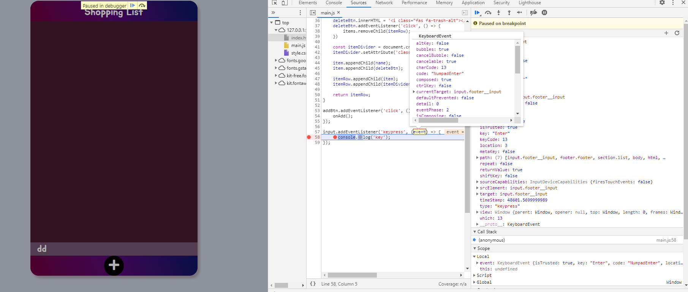
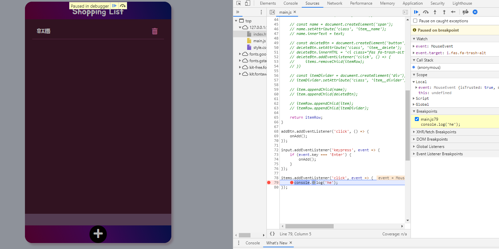
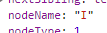

### 개발자 실력 향상을 위한 공부법

1. 우리는 모든 것을 다 알지 못한다.
2. 문제 해결능력 연습이 중요하다.
3. 능동적으로 강의를 들어야 한다.
4. 이해를 먼저 하고, 노트를 정리
5. 원활한 의사소통 정말 중요하다.

---

### WEB APIs

브라우저에 대해 완벽히 이해

APIs : Application Programming Interfaces

---

DOM(Document Object Model) APIs

Network APIs

Graphics APIs

Audio/Video APIs

Device APIs

File APIs

Storage APIs

https://developer.mozilla.org/en-US/docs/Learn/JavaScript/Client-side_web_APIs/Introduction

https://developer.mozilla.org/en-US/docs/Web/API

https://www.thoughtco.com/what-javascript-cannot-do-2037666

---

HTTP <- Hypertext Transfer Protocol

서버가 어떻게 통신하는지 통신규약을 정해 놓은 것

클라이언트가 서버에게 정보를 요청하고 다시 서버에서 정보를 받아오는 request를 하고 response를 받아오는 방식으로 이루어져 있음

HTTPS는 HTTP에 S가 더해진 것 Hypertext Transfer Protocol Secure

즉 정보를 주고받는 것들이 잘 감싸져있는 보안 처리가 잘 된. secure하게 encrypt가 되어서

몇몇 Web APIs는 HTTPS 환경에서만 동작 가능

External APIs를 활용해 웹 어플리케이션 제작

---

브라우저에서 웹 페이지를 열면 Window(전체적인 창)라는 전체적인 오브젝트가 존재, 

Window 안에 페이지가 표기되는 부분이 Document 오브젝트(HTML에서 작성한 요소들이 표기),

Navigator(사용자 눈에는 보이지 않지만 전체적으로 Window에 관련된 즉 브라우저 자체 관련 정보들이 담겨있음) 오브젝트

window -> DOM, BOM(Browser Object Model - navigator, location, fetch, storage ... ), JavaScript ..

`console.log(window)`

`console.log(this)`

Window는 글로벌 오브젝트

size, scroll, load 확인 때 많이 쓰임

---

### Window Size

```
window.screen <- 모니터 사이즈
------------------------------------
아래는 브라우저 사이즈 변경되면 업데이트
window.outer <- 브라우저 사이즈
window.inner <- 페이지가 표기되는 부분 전체
documentElement.clientWidth <- 스크롤바 제외한 순수 document문서 자체
```

---

### coordinates (좌표)

왼쪽 최상위가 (0, 0)

`Element.getBoundingClientRect()`  <- 요소가 브라우저 위에서 즉 window 위에서 얼마나 멀리 떨어져 있는지, 크기 얼마인지 등

left <- x축

top <- y축

bottom <- 브라우저 제일 위에서 요소 밑까지. 

right <- 왼쪽에서 제일 끝까지

cf) CSS 에서는 포지션을 absolute나 relative로 지정하게 되면 top과 left / right(브라우저 제일 오른쪽으로부터 떨어진 거리)과 bottom(브라우저 제일 밑에서 떨어진 거리) 이용. 


### Client x,y  vs  Page x,y

Client x, y  <- 브라우저 window에서 좌표값에 해당

Page x, y  <- 문서의 제일 시작점부터 x, y 계산

---

### Window load


---

### DOM 큰 그림 이해하기

#### Document Object Model

HTML Tag -> JavaScript Node

Node라는 오브젝트는 EventTarget이라는 오브젝트를 상속한다. 즉 EventTarget의 오브젝트. 모든 Node는 이벤트가 발생할 수 있다.

document도 Node를 상속하기 때문에 즉 document도 Node(<- EventTarget이므로)이므로 document에서도 이벤트가 발생할 수 있다

이미지나 이런 html 요소들은 Element로 변환이 된다

Element도 Node이고 Node는 EventTarget이기 때문에 모든 요소에서 이벤트가 발생할 수 있다

Text도 마찬가지

Element에도 다양한 Element가 있는데 html 요소라면 HTMLElement가 되고 SVG 요소라면 SVGElement

각각의 타입별로 Element가 존재

HTMLElement 안에는 어떤 태그를 쓰냐에 따라 HTMLInputElement가 될 수 있고 HTMLDivElement가 될 수 있다

HTMLImageElement가 될 수 있고 굉장히 많은 태그별로 Element 존재

모든 태그의 요소들은 각각 HTML 태그의 Element이고 이런 각각의 HTML 태그의 Element는 HTML의 Element이고 

HTMLElement는 결국 Element이고 Element는 결국 Node 이고 Node는 EventTarget

=> 브라우저가 웹페이지 즉 html 파일을 읽어서 한 줄씩 읽으면서 DOM(Document Object Model) 트리로 변환, 브라우저가 이해할 수 있도록 자신들만의 오브젝트 나무로 만들어나가는 것

---

```
html(HTMLHtmlElement)
---------------------
head(HTMLHeadElement) body(HTMLBodyElement)
-------------------------------------------
meta(HTMLMetaElement) title(HTMLTitleElement) link(HTMLLinkElement) | section(HTMLSectionElement) span(HTMLSpanElement)
-------------------------------------------------------------------------------------------------
img(HTMLImageElement) h1(HTMLHeadingElement) TextNode(..) 
```

html 파일을 브라우저에서 읽으면 브라우저도 실행되고 있는 어플리케이션이기 때문에 이 어플리케이션이 이해할 수 있는 즉 메모리에 보관할 수 있는 오브젝트로 변환하게 된다

각각의 태그들이 그에 맞는 오브젝트로 맵핑되어서 표기가 됨

window -> DOM(document ...), BOM(Browser Object Model - navigator, location, fetch, storage ... ), JavaScript(Array, Map, Date ...)

https://developer.mozilla.org/en-US/docs/Web/API/Node

Dom Node라는 인터페이스는 DOM API를 쓰는데 필수적인 인터페이스

Node 안에는 document나 Element 이런 애들이 들어있다

EventTarget <- Node 

Node가 EventTarget을 상속한다(모든 Node는 EventTarget)

https://developer.mozilla.org/en-US/docs/Web/API/EventTarget

* EventTarget.addEventListener ()
* EventTarget.removeEventListener ()
* EventTarget.dispatchEvent ()

---

Use $0 in the console

`$0`

`$0.childNodes`

`$0.nextSibling`

`$0.parentNode`

---

CSSOM : CSS Object Model

CSS Style은 브라우저가 어떻게 이해할까?

브라우저에서 Document Object Model을 만들게 되면 우리가 정의한 CSS를 병합해서 CSSOM이라는 것을 만든다

브라우저가 html 파일을 Document Object Model로 만들었다면 

html 파일 안에 들어있는 스타일 즉 임베디드된 스타일 또는 CSS 파일에 정의한 CSS나 html 태그에 정의한 스타일 요소들이나 이런 스타일이 따로 지정이 되어 있지 않아도 브라우저상에서 기본적으로 가지고 있는 스타일이 있는데 이런 모든 스타일에 관련된 정보들을 합해서, 즉 DOM과 CSS의 요소를 병합해서 CSSOM이라는 트리를 다시 만든다

CSSOM <- 브라우저에서 기본적으로 설정된 모든 속성값들도 포함. 즉 cascading 룰에 따라서 합해진 이런 모든 CSS 값들이 정의되어 있다. 이것을 computed styles라고 부르는데 모든 것들이 다 이미 계산된 스타일을 말함

DOM + CSSOM = Render Tree

---

### Critical rendering path 성능 보장 렌더링 순서

HTML request/response -> loading -> scripting(DOM, CSSOM) -> rendering(렌더링 트리 만들기) -> layout -> painting

<--------------------------------- Construction --------------------------------><-------------------------- Operation ------------------------>

Construction : DOM + CSSOM + RenderTree

Operation : layout, paint, composition

layout. 우리가 만든 RenderTree(DOM 요소뿐만 아니라 최종적으로 계산된 CSS 스타일 포함). 그 정보를 기반으로 그 다음에 paint 과정 일어나는데 다양한 속성값에 따라 브라우저 엔진마다 성능 개선을 위해 레이어를 만든다

CSS will-change 속성값(불필요하게 너무 많이 쓰지X)은 브라우저에게 이 요소는 변화될지도 모른다고 말하면 브라우저는 새로운 레이어에다가 추가해놓음

rendering tree를 만들 때 어떻게 하면 빠르게 만들 수 있을까? 

DOM 요소가 작으면 작을수록, CSS 규칙이 작으면 작을수록 tree가 작아지기 때문에 빠르게 만들 수 있음

불필요한 태그 사용X, div 태그 남용X, wrapping 클래스나 wrapping 요소 쓸데없이 만들기X

최대한 요소들을 작게 만들기

Operation time에는 performant user interactions avoid jank ensure reflows & repaints at 60 f/s

paint가 자주 일어나지 않도록 만들기

자바스크립트나 CSS로 DOM 요소를 조작할 때 composition만 다시 일어나면 best, layout 다시 일어나게 하면 최악

---

개발툴에 ... - More tools - Layers

```css
img {
    z-index: 100;
    will-change: opacity;
}
```

이미지를 다른 레이어로 표기하는거 확인

---

http://csstriggers.com/

---

개발툴 - Performance - Screenshots 체크

Record 누르고 측정하고 싶은 동작 하기 Stop

빨간색은 경고

사용자가 부드럽고 완만한 경험하려면 1초당 60개 프레임이 화면에 계속 계속 보여줘야 함

한 프레임이 보여질 때 16.67밀리세컨드 동안 이루어져야 됨

무언가를 처리해서 화면에 업데이트 되는 게 16ms 넘어가는 순간 사용자가 화면 이상하다고 느낌

Layout Shift 클릭하면 밑에 자세히 설명 나옴

윈도우는 Ctrl + Shift + p

맥은 command shift p 누르면 개발툴 팔레트 이용 가능

layout 검색하면 Show layout shift regions 메뉴 클릭하면 layout이 어떻게 발생하고 있는지 나옴

---

querySelector는 처음에 찾아진 Element를 리턴

만약 찾지 못하면 null을 리턴


Element의 레퍼런스 즉 Element의 변수를 가지고 있으면서 조금 더 많은 동작을 해야하면 createElement 만들어 쓰고

한번 업데이트한 후 다시 변경할 일 없으면 innerHTML을 이용해서 동적으로 추가

---

**CSS Gradient**

https://cssgradient.io/

**Box Shadow CSS Generator**

https://www.cssmatic.com/box-shadow

---

##### 디버깅

개발툴 - Sources

Breakpoints

Watch <- + 누르고 



---

### Event 이벤트

https://developer.mozilla.org/en-US/docs/Learn/JavaScript/Building_blocks/Events

https://developer.mozilla.org/en-US/docs/Web/Events

* mouse click
* keyboard
* resizing window
* close window
* page loading
* form submission
* video is being played
* error

특정한 요소에 Event Handler 등록 -> 브라우저에서 다양한 정보가 들어있는 이벤트라는 오브젝트 만들어서 콜백 함수에 전달

EventTarget을 상속하는 모든 요소에 이벤트 핸들러 등록 가능

이벤트타겟에는 3개의 API가 있다

* EventTarget.addEventListener()
* EventTarget.removeEventListener()
* EventTarget.dispatchEvent()

```javascript
$0.addEventListener('click', () => {console.log('clicked!')});
```

```javascript
$0.dispatchEvent(new Event('click'));
```

```javascript
const listener = () => {console.log('clicked!')};  // 콜백 함수 등록
$0.addEventListener('click', listener);
$0.removeEventListener('click', listener);
```

---

**Bubbling and Capturing** 

https://developer.mozilla.org/en-US/docs/Learn/JavaScript/Building_blocks/Events#Event_bubbling_and_capture

capturing 부모 컨테이너에서 부터 시작해서 캡처링을 통해서 내려옴 이벤트 핸들러 호출

이벤트는 버블링 업 해서 상위에 있는 부모에게 이벤트 발생했다고 해서 부모에게 등록된 이벤트 핸들로 호출, 그 상위에 또 등록된 부모의 이벤트 핸들러 호출

버블링은 신경써서 하자

```javascript
// event.stopPropagation();
event.stopImmediatePropagation();
```

위는 사용하지 않는 것이 좋다

부모에다가 아래 코드 쓰기

```javascript
if (event.target !== event.currentTarget) {
    return;
}
```

---

scrolling과 같이 passive가 true로 설정된 애들은 웬만해서는 passive를 false로 설정X

---

##### 이벤트델리게이션 이벤트 위임

이벤트 버블링 이해

부모 컨테이너는 어떤 자식 요소에서 이벤트가 발생하든 모든 이벤트를 다 들을 수가 있다

부모 안에 있는 자식들에게 공통적으로 무언가 처리를 해야할 때 일일이 이벤트 리스너를 자식 노드에 추가하는 것 보단 부모에 등록하는 것이 좋다

---



