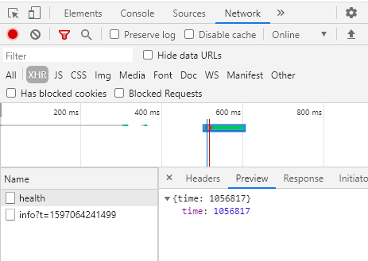

인증: 로그인, 로그아웃

보드작업(생성, 조회, 수정, 이동, 삭제)

- 보드
- 리스트
- 카드

|        | 생성  | 조회  | 수정               | 이동  | 삭제  |
| ------ | ----- | ----- | ------------------ | ----- | ----- |
| 보드   | **O** | **O** | O 타이틀, 색상     | X     | O     |
| 리스트 | O     | X     | O 타이틀           | O     | O     |
| 카드   | **O** | **O** | **O 타이틀, 설명** | **O** | **O** |

<기본 플로우>

홈 페이지 접속 (비인가 요청은 로그인 페이지 이동) 

로그인 페이지 접속: 로그인 수행

홈 페이지 리다이렉트

보드 목록 조회

보드 생성: 생성한 보드 화면 이동

보드 조회: 자동 생성된 리스트 나열 (Todo, Doing, Done)

카드 생성: 타이틀 입력

카드 상세 조회: 모달창

카드 수정: 타이틀, 설명

카드 이동 1: 리스트 내에서 이동

카드 이동 2: 리스트 간에 이동

카드 삭제

보드 세팅: 사이드바

보드 삭제: 삭제 후 홈 페이지 이동

<추가 기능>

보드 수정: 색상 변경

보드 수정: 타이틀 변경

리스트 생성

리스트 수정: 타이틀 변경

리스트 이동

리스트 삭제

---

`npm install -g vue-cli`

`mkdir vue-trello`

`cd vue-trello`

`vue init webpack-simple`

Yes

sass No

`npm i`

`npm run dev`

하라는데 안되어서

`vue init webpack-simple vue-trello` 하니까

`npm install -g @vue/cli-init` 하라고 함

폴더 지우고 다시 

`vue init webpack-simple vue-trello` 

`cd vue-trello`

`npm i`

`npm run dev`

---

서버 라우팅  <- 네이버, 구글같은

브라우져 라우팅  <- 좀 더 효율적으로 화면 갱신. 구글 메일, 트렐로. 하나의 화면으로 어플리케이션 동작, 페이지가 변경될 때마다 필요한 데이터 api로 호출

---

`npm i vue-router --save-dev`

`npm i vue-router --save`

---

api 호출

https://ide-run.goorm.io/workspace/server?language=kor#

`curl localhost:3000/health`

`curl localhost:3000/health -v | jq`

---

자바스크립트 코드로 호출하려면

HttpXMLRequest 객체

---

`npm install axios`

https://server-msvml.run.goorm.io/

---

`curl localhost:3000/boards -vs | jq`

