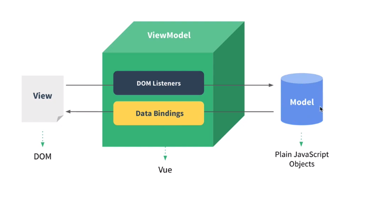

chrome

visual studio code

node.js

vue.js dev tools

---

joshua1988/learn-vue-js

https://github.com/joshua1988/learn-vue-js

---

- Vetur
- Night Owl
- Material Icon Theme
- Live Server
- ESLint
- Prettier
- Auto Close Tag
- Atom Keymap

---

Vue는 MVVM 패턴의 뷰모델(ViewModel) 레이어에 해당하는 화면(View)단 라이브러리



---

Ctrl + \ 패널 토글 단축키

---

뷰 인스턴스

뷰로 개발할 때 필수로 생성해야 하는 코드

```vue
new Vue();
```

---

뷰 컴포넌트

화면의 영역을 구분하여 개발할 수 있는 뷰의 기능

재사용성이 올라가고 빠르게 화면 제작

---

상위에서 하위로 데이터 내려줌, 프롭스 속성

하위에서 상위로 이벤트 올려줌, 이벤트 발생

---


