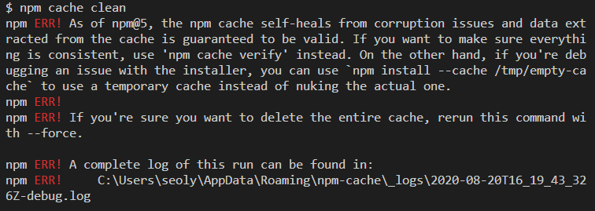

`npm i -g @vue/cli`

`vue --version`

`vue create vue-movie-app`

`vue ui`

플러그인 추가  vuetify

안돼서 `vue add vuetify` 도 안돼서

https://github.com/vuetifyjs/vue-cli-plugins/issues/140

`npm install node-sass`

해도 안돼서

node_modules 제거 후 `npm i`

해도 안됨

---

 Error: [VuetifyLoaderPlugin Error] No matching rule for vue-loader found.
Make sure there is at least one root-level rule that uses vue-loader.

`npm uninstall vuetify`

`npm install --save vuetify sass sass-loader fibers deepmerge`

해도 에러 나서 vue2로 새로 함

---

