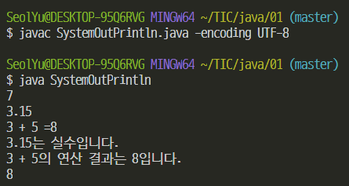

### JDK 다운로드 및 설치

www.oracle.com 에서 JDK 를 다운로드


자바의 기본 도구

- javac.exe 자바 컴파일러 (Java Compiler)
- java.exe 자바 런처 (Java Launcher)

명령프롬프트 상에서 실행

환경 변수 Path - 소프트웨어 경로


### jdk 디렉토리 - bin 디렉토리

변수 이름은 Path 값은 디렉토리


내 컴퓨터 - 속성 - 고급 시스템 설정 - 환경변수

상위 폴더 jdk 경로 복사해서

새 시스템 변수 

JAVA_HOME 

C:\Program Files\Java\jdk-13.0.2


Path 편집 누르고

새로만들기

%JAVA_HOME%\bin


cmd 창에서 java -version

java

javac


`javac FirstJavaProgram.java`

파일 이름

javac가 실행되면서 컴파일함

dir

.class 만들어져있음(컴파일 제대로 됨)


실행할 땐

`java FirstJavaProgram`

.class 생략

java.exe 가 실행되면서 FirstJavaProgram.class 찾아서 실행


일반적으로

Hardware - Operating System - Program 운영체제가 프로그램을 관리하고 실행


자바 프로그램은

Hardware - Operating System - Java Virtual Machine - Program

자바 가상 머신에 종속되어서 실행


java.exe <- 자바 런처

자바가상머신 구동, 그 위에 자바 프로그램 올려서 자바 프로그램 실행하도록 초기 준비


Hardware - Windows - Windows JVM - Java Program

Hardware - Linux - Linux JVM - Java Program

운영체제(OS) 다르면 JVM 다르다


자바 컴파일러(javac.exe)

소스파일(소스코드 존재하는 파일) --컴파일러 역할--> 클래스파일(바이트코드 존재하는 파일 .class)


자바 런처(java.exe)

* 자바 프로그램과 자바 가상머신을 처음 구동하는 소프트웨어
* 클래스 파일을 대상으로 구동을 시작


```java
class FirstJavaProgram
{
    public static void main(String[] args)
    {
        System.out.println("Welcome to Java");
        System.out.println("First Java Program");
    }
}
```

* 중괄호를 이용해서 클래스와 메소드의 영역을 구분
* 문장(명령문O, 정보전달X)의 끝에는 세미콜론을 붙여서 문장의 끝 표시

* 프로그램 실행 시 main 메소드 안 문장들 순차적 실행
* System.out.println의 괄호 안에 출력 내용 큰따옴표를 묶어서 표시
* System.out.println  실행 이후 자동 개행


