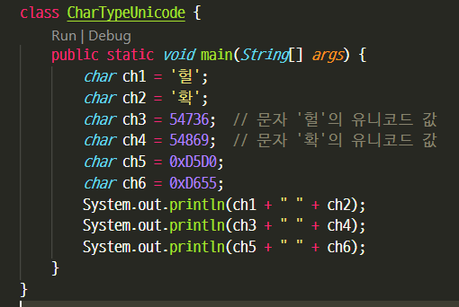
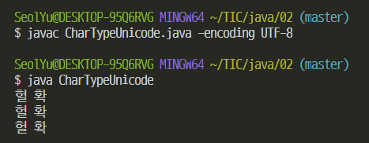

### 변수(Variable)

- 메모리 공간의 활용을 위한 도구
- 메모리 공간의 할당과 접근을 위해 필요한 도구
- 변수의 선언은 '메모리 공간의 할당'으로 이어짐


변수의 선언을 통해 결정하는 두가지

* 변수의 이름
* 변수의 용도

```java
int num1;  // 변수 num1 의 선언
int num2;  // 변수 num2 의 선언
```


1. 자바는 대소문자를 구분한다
2. 변수의 이름은 숫자로 시작할 수 없다
3. $ 와 _ 이외의 특수문자는 변수의 이름에 사용할 수 없다
4. 키워드는 변수의 이름으로 사용할 수 없다


### 정수의 표현 방식

* 부호 비트가 0이면 양의 정수, 1이면 음의 정수
* 부호 비트가 0이면, 나머지 비트들은 값의 크기를 결정


### 음의 정수를 표현하는 방법

* 양의 정수의 이진수 표현에 2의 보수를 취한 결과를 음의 정수로 표현
* 이 경우, 임의의 양의 정수가 있을 때, 이와 절댓값이 같은 음의 정수의 합은 0이 된다.
* 1의 보수 -> 1을 더한다, 올림수 버림


### 실수의 표현 방식

* 정수와 달리 실수는 오차 없이 표현이 불가능
* 따라서 정밀도 낮추고 표현할 수 있는 값의 범위 넓힘
* 실수 표현 방법의 기준 IEEE 754
* double num1 = 1.000001;  // 최대한 가까운 실수의 표현이 저장됨


### 자바의 기본 자료형

| byte   | short  | int    | long   |
| ------ | ------ | ------ | ------ |
| 1 byte | 2 byte | 4 byte | 8 byte |

변수의 자료형 결정은 '해당 변수에 값을 저장 및 참조하는 방식의 결정'을 의미


기본적인 4칙연산은 int형 사용

정수는 int 형으로 선언하자

연산이 불필요하면서 데이터양 많은 경우엔 short 사용 


| float  | double |
| ------ | ------ |
| 4 byte | 8 byte |

float와 double 사이에서의 자료형 선택 기준은 정밀도!


### 문자 자료형

* 자바의 문자 자료형 char
* 자바는 문자를 2바이트 유니코드로 표현
* 작은 따옴표로 묶어서 하나의 문자를 표시
* 문자의 저장은 유니코드 값의 저장으로 이어진다






### 논리 자료형

true '참' 을 의미하는 값

false '거짓' 을 의미하는 값