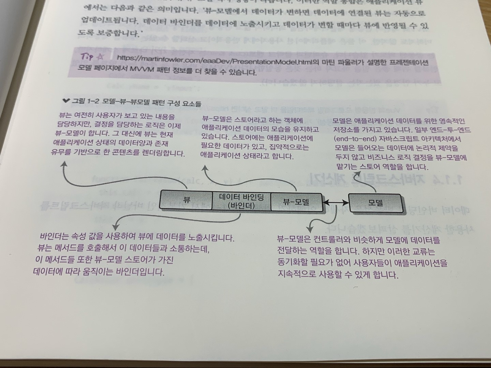

모델-뷰-컨트롤러(MVC) 

몇 년 동안 개발자들은 비동기식 웹 요청과 클라이언트 단 MVC를 사용하여 서버로 전송된 요청들이 차단되지 않고 응답 없이 계속 진행하는 방식으로 웹 애플리케이션의 상호 작용성을 높여 왔지만, 웹 애플리케이션이 데스크톱 역할을 대신하기 시작하면서 클라이언트/서버의 소통을 마냥 기다리는 것은 사용자에게 애플리케이션이 비정상적으로 작동하는 것처럼 보일 수 있는데, 모델-뷰-뷰모델 패턴이 이를 해결할 수 있었다.

자바스크립트 프레임워크가 비동기 방식의 프로그래밍을 지원하기 시작하면서 웹 애플리케이션은 더 이상 완전한 웹 페이지를 요청할 필요가 없다. 그러면서 웹 사이트와 애플리케이션은 뷰를 일부분만 업데이트하며 더 빠르게 반응할 수도 있었지만, 이 과정에서 많은 작업이 중복되었다. 특히 프레젠테이션 로직과 비즈니스 로직이 중복되었다.

정제된 MVC 모습인 모델-뷰-뷰모델(MVVM) 패턴의 가장 큰 차이점은 뷰 모델 도입과 데이터 바인딩(합쳐서 바인더(binder))에 있다.

MVVM 은 전체 설계를 넘나들며 수많은 코드 중복과 이것에 기인한 쓸데없는 노력을 줄이면서, 빠른 상호 작용과 피드백을 갖춘 클라이언트 단 애플리케이션을 개발할 수 있는 청사진을 제공한다.(유닛 테스트하기에도 훨씬 쉽다) 그래서 MVVM 은 간단한 UI에는 오히려 많은 작업이 될 수 있다.

앱 애플리케이션에서 MVVM 설계 방식은 개발자가 사용자 반응에 즉각 응답할 수 있는 소프트웨어를 만들 수 있게 하며, 사용자에게는 하나의 일에서 다른 일로 자유롭게 움직일 수 있게 한다.

뷰-모델 역시 성향이 다른데 이러한 역할 통합은 애플리케이션 뷰에서는 '뷰-모델에서 데이터가 변하면 데이터에 연결된 뷰는 자동으로 업데이트된다. 데이터 바인더를 데이터에 노출시키고 데이터가 변할 때마다 뷰에 반영될 수 있도록 보증한다' 는 의미이다.

### 반응형 애플리케이션

* 애플리케이션 상태 변화를 관찰한다
* 애플리케이션 전체에 변경 알림을 전달한다
* 상태 변화에 따라 뷰를 자동 렌더링한다
* 사용자 상호 작용을 위해 시기 적절한 피드백을 제공한다

반응형 웹 애플리케이션은 지속적인 상호 작용이 막히는 것을 방지하고 가능한 함수적 프로그래밍 관용구를 사용하는 비동기 기술인 MVVM 디자인 원칙에 따라 이러한 조건들을 만족시킨다.

MVVM 패턴이 반응형 애플리케이션을 의미하지 않고 반응형 애플리케이션이 MVVM 패턴을 의미하지도 않지만, 이 둘은 애플리케이션 사용자에게 반응적이고 신뢰할 수 있는 경험을 제공하려는 공통된 의도가 있다.

