뷰의 템플릿 문법

뷰로 화면을 조작하는 방법. 

* 데이터 바인딩
* 디렉티브


#### 데이터 바인딩

뷰 인스턴스에서 정의한 속성들을 화면에 표시하는 방법

콧수염 괄호(Mustache Tag)

```html
<div>
    {{ message }}
</div>
```

```javascript
new Vue({
    data: {
        message: 'Hello Vue.js'
    }
})
```


#### 디렉티브

뷰로 화면의 요소를 더 쉽게 조작하기 위한 문법 

HTML 태그에서 일반적인 id, class 등 표준 속성을 제외하고 v- 붙는 속성들 => 뷰 디렉티브

```html
<div>
    Hello <span v-if="show">Vue.js</span>
</div>
```

```javascript
new Vue({
    data: {
        show: false
    }
})
```


```html
<div id="app">
    {{ str }}
</div>

<script src="https://cdn.jsdelivr.net/npm/vue/dist/vue.js"></script>
<script>
    new Vue({
        el: '#app',
        data: {
            str: 'hi'
        }
    })
</script>
```

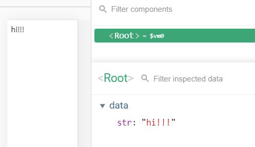

값을 바꿨을 때 바로 화면에 반영되어서 갱신(다시 그려짐)되는 것 -> reactivity

값이 연결되는 구간 - 데이터바인딩


데이터 값에 따라서 바뀌는 값을 정의할 때 computed 속성 활용

```html
<div id="app">
    <p>{{ num }}</p>
    <p>{{ doubleNum }}</p>
</div>

<script src="https://cdn.jsdelivr.net/npm/vue/dist/vue.js"></script>
<script>
    new Vue({
        el: '#app',
        data: {
            num: 10,
        },
        computed: {
            doubleNum: function() {
                return this.num * 2;
            }
        }
    })
</script>
```

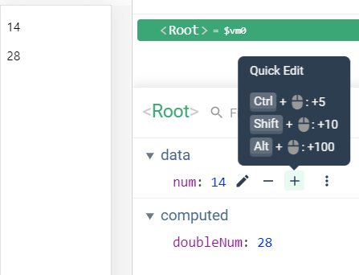


#### 뷰 디렉티브와 v-bind

```html
<div id="app">
    <p v-bind:id="uuid" v-bind:class="">{{ num }}</p>
    <!-- 위 내용은 실제 화면에서 아래와 같이 나타남 -->
    <!-- <p id="abc1234">{{ num }}</p> -->
    <p>{{ doubleNum }}</p>
</div>

<script src="https://cdn.jsdelivr.net/npm/vue/dist/vue.js"></script>
<script>
    new Vue({
        el: '#app',
        data: {
            num: 10,
            uuid: 'abc1234',
            name: 'text-blue'
        },
        computed: {
            doubleNum: function() {
                return this.num * 2;
            }
        }
    })
</script>
```


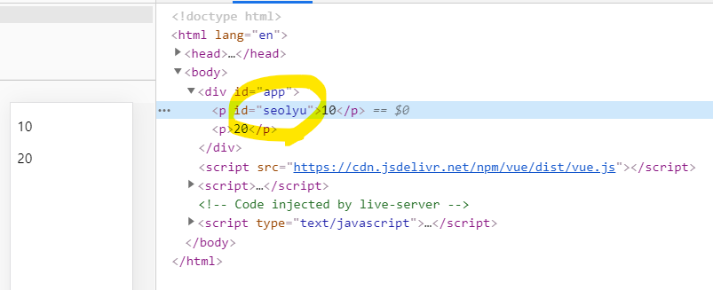

v-bind:id 문법 이용해서 편하게 데이터 조작해서 값 바꾸기 


#### 클래스 바인딩

```html
<div id="app">
    <p v-bind:id="uuid" v-bind:class="name">{{ num }}</p>
    <!-- 위 내용은 실제 화면에서 아래와 같이 나타남 -->
    <!-- <p id="abc1234">{{ num }}</p> -->
    <p>{{ doubleNum }}</p>
</div>

<script src="https://cdn.jsdelivr.net/npm/vue/dist/vue.js"></script>
<script>
    new Vue({
        el: '#app',
        data: {
            num: 10,
            uuid: 'abc1234',
            name: 'text-blue'
        },
        computed: {
            doubleNum: function() {
                return this.num * 2;
            }
        }
    })
</script>
```


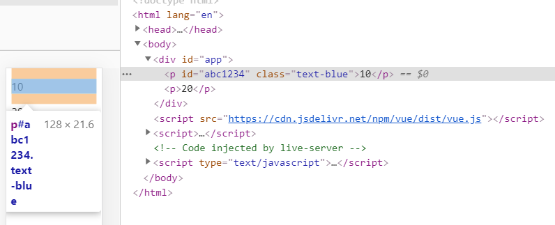


```html
<div id="app">
    <p v-bind:id="uuid" v-bind:class="name">{{ num }}</p>
    <!-- 위 내용은 실제 화면에서 아래와 같이 나타남 -->
    <!-- <p id="abc1234">{{ num }}</p> -->
    <p>{{ doubleNum }}</p>
    <div v-if="loading">
        Loading...
    </div>
    <div v-else>
        test user has been logged in
    </div>
</div>

<script src="https://cdn.jsdelivr.net/npm/vue/dist/vue.js"></script>
<script>
    new Vue({
        el: '#app',
        data: {
            num: 10,
            uuid: 'abc1234',
            name: 'text-blue',
            loading: true  // 로딩 중
        },
        computed: {
            doubleNum: function() {
                return this.num * 2;
            }
        }
    })
</script>
```

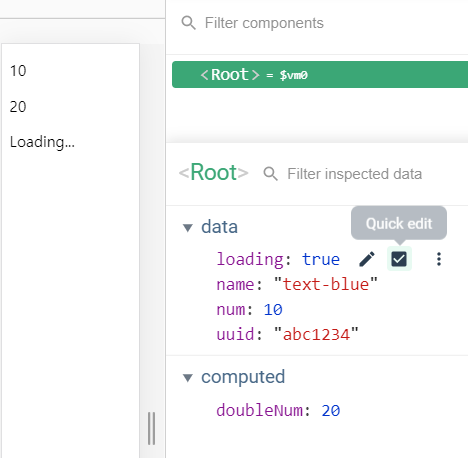

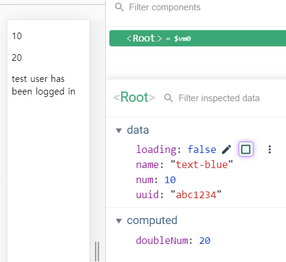

```html
<div v-if="loading">
    Loading...
</div>
<div v-else>
    test user has been logged in
</div>
<div v-show="loading">
    Loading...
</div>
```

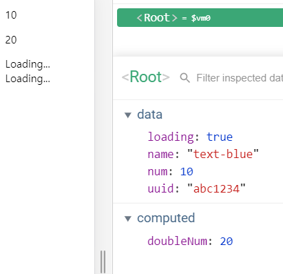

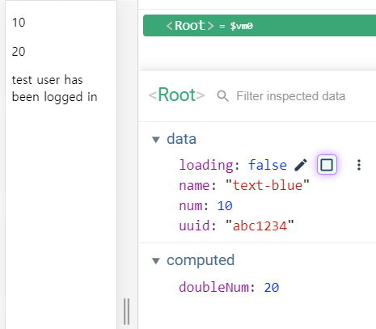

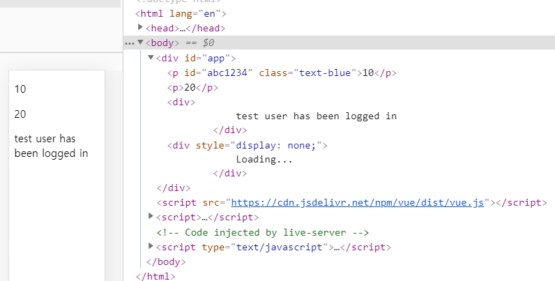

if는 돔을 아예 제거하고

show는 css style에서 "display: none;" <- 육안상으로만 안보이고 돔 정보 남아있음


#### 모르는 문법 나왔을 때 공식 문서 보고 해결하기

```html
<!-- TODO: 인풋 박스를 만들고 입력된 값을 p 태그에 출력해보세요 -->
<input type="text">
<p></p>
```

http://vuejs.org/


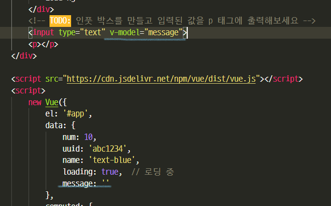


```html
<!-- TODO: 인풋 박스를 만들고 입력된 값을 p 태그에 출력해보세요 -->
<input type="text" v-model="message">
<p>{{ message }}</p>
```

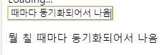

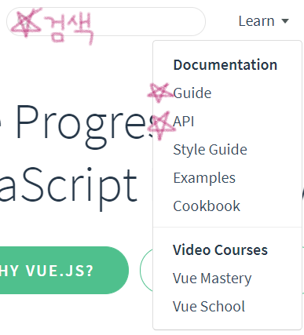


#### methods 속성과 v-on 디렉티브를 이용한 키보드, 마우스 이벤트 처리 방법

```html
<div id="app">
    <button v-on:click="logText">click me</button>
</div>

<script src="https://cdn.jsdelivr.net/npm/vue/dist/vue.js"></script>
<script>
    new Vue({
        el: '#app',
        methods: {
            logText: function() {
                console.log('clicked');
            }
        }
    })
</script>
```

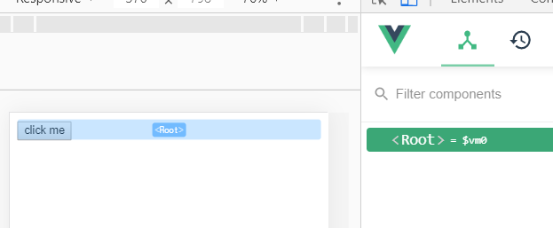

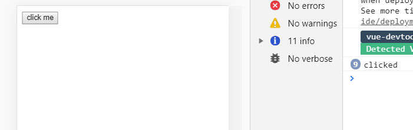

```html
<div id="app">
    <button v-on:click="logText">click me</button>
    <input type="text" v-on:keyup="logText">
</div>

<script src="https://cdn.jsdelivr.net/npm/vue/dist/vue.js"></script>
<script>
    new Vue({
        el: '#app',
        methods: {
            logText: function() {
                console.log('clicked');
            }
        }
    })
</script>
```

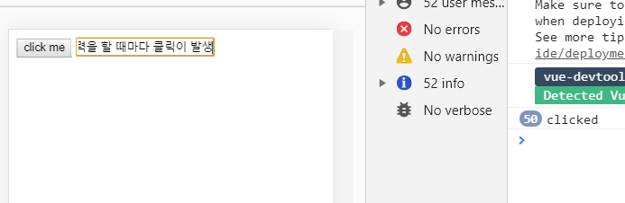

```html
<input type="text" v-on:keyup.enter="logText">
```

`.enter`  <- 이벤트에 추가로 붙는게 이벤트 modifier

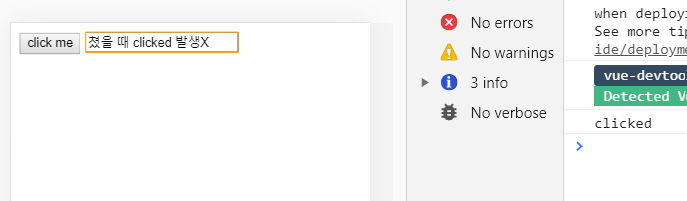

Enter 치면 clicked 나옴

```html
<button v-on:click="logText">click me</button>
<input type="text" v-on:keyup.enter="logText">
<button>add</button>
```

이벤트 modifier를 이용해, 사용자가 Enter 쳤을 때 마치 add버튼에 붙여놓은 이벤트, 메서드가 실행되는 것처럼 할 수 있음

