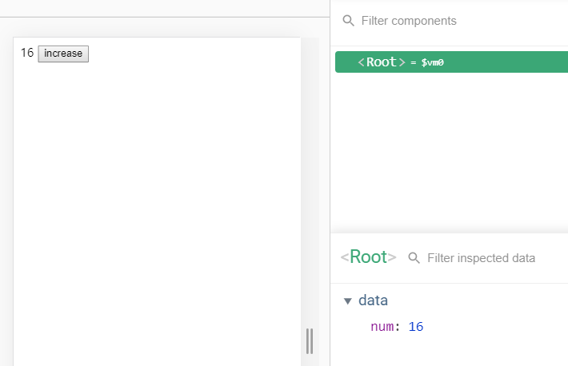
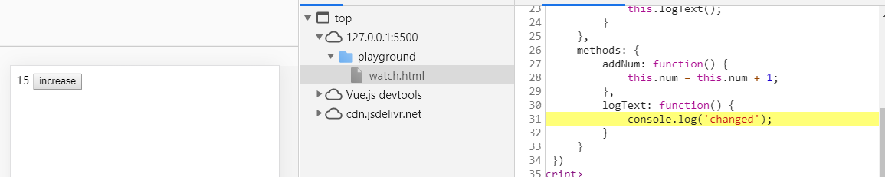
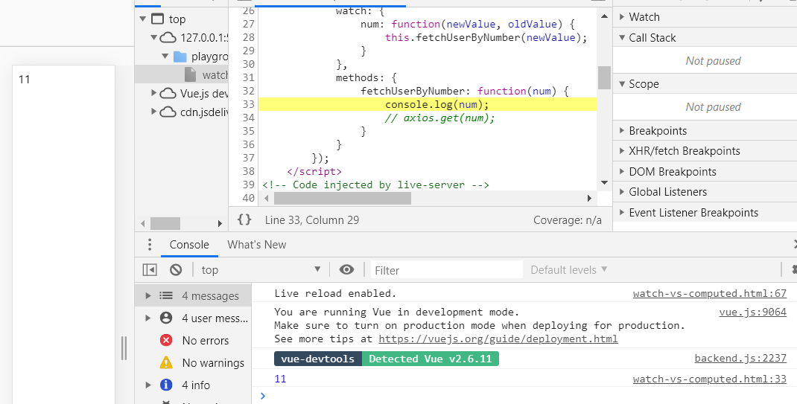
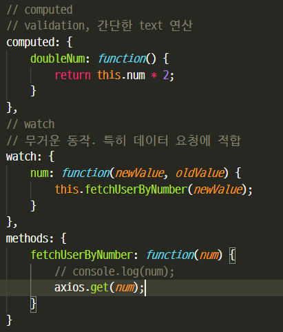
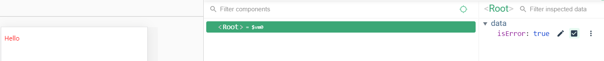
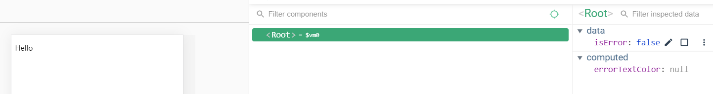
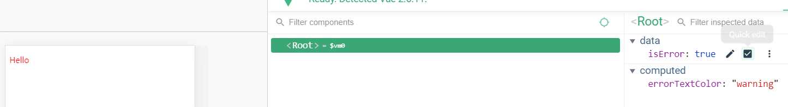

#### watch

```html
<div id="app">
    {{ num }}
    <button v-on:click="addNum">increase</button>
</div>

<script src="https://cdn.jsdelivr.net/npm/vue/dist/vue.js"></script>
<script>
    new Vue({
        el: '#app',
        data: {
            num: 10
        },
        methods: {
            addNum: function() {
                this.num = this.num + 1;
            }
        }
    })
</script>
```




```html
<div id="app">
    {{ num }}
    <button v-on:click="addNum">increase</button>
</div>

<script src="https://cdn.jsdelivr.net/npm/vue/dist/vue.js"></script>
<script>
    new Vue({
        el: '#app',
        data: {
            num: 10
        },
        watch: {
            num: function() {
                this.logText();
            }
        },
        methods: {
            addNum: function() {
                this.num = this.num + 1;
            },
            logText: function() {
                console.log('changed');
            }
        }
    })
</script>
```

watch <- data의 변화에 따라서 특정 로직을 실행할 수 있음

num을 바꿀 떄마다 this.logText() 실행




#### watch 속성 vs computed 속성

```html
<div id="app">
    {{ num }}
</div>

<script src="https://cdn.jsdelivr.net/npm/vue/dist/vue.js"></script>
<script>
    new Vue({
        el: '#app',
        data: {
            num: 10
        },
        computed: {
            doubleNum: function() {
                return this.num * 2;
            }
        },
        watch: {
            num: function(newValue, oldValue) {
                this.fetchUserByNumber(newValue);
            }
        },
        methods: {
            fetchUserByNumber: function(num) {
                console.log(num);
                // axios.get(num);
            }
        }
    });
</script>
```






 [명령적인 `watch` 콜백보다 computed 속성을 사용하는 것이 더 좋습니다](https://kr.vuejs.org/v2/guide/computed.html)


#### computed 속성을 이용한 클래스 코드 작성 방법

```html
<style>
    .warning {
        color: red;
    }
</style>
```

```html
<div id="app">
	<!-- p태그의 클래스는 isError가 true일 때는 warning이 들어가고 false일 때는 들어가지 않음 -->
    <p v-bind:class="{ warning: isError }">Hello</p>
</div>

<script src="https://cdn.jsdelivr.net/npm/vue/dist/vue.js"></script>
<script>
    new Vue({
        el: '#app',
        data: {
            // cname: 'blue-text',
            isError: false
        }
    });
</script>
```





위에서 표현한 클래스 바인딩에 대해서

computed를 이용해 깔끔하게

```html
<div id="app">
    <!-- p태그의 클래스는 isError가 true일 때는 warning이 들어가고 false일 때는 들어가지 않음 -->
    <p v-bind:class="errorTextColor">Hello</p>
</div>

<script src="https://cdn.jsdelivr.net/npm/vue/dist/vue.js"></script>
<script>
    new Vue({
        el: '#app',
        data: {
            // cname: 'blue-text',
            isError: false
        },
        computed: {
            errorTextColor: function() {
                // if (isError) {
                //     return 'warning'
                // } else {
                //     return null;
                // }
				
                // computed 에서 데이터 속성에 접근하려면 this.
                return this.isError ? 'warning' : null;
            }
        }
    });
</script>
```




