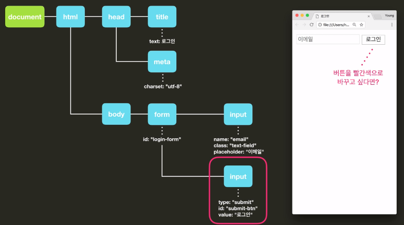

문서 객체 모델 (Document Object Model) 

DOM


자바스크립트에서 DOM 의 중요성


웹사이트에서 어떤 요소를 바꾸고 싶으면 그 요소의 DOM 객체에 접근해서 그 객체를 바꿔줘야 함

브라우저는 바뀐 DOM 을 시각화해서 반영



DOM의 최상위 객체는 document

document 객체가 DOM의 다른 객체에 접근 가능하게 해준다

DOM 트리에 접근 가능하도록 자동으로 주어짐

```javascript
document
```

```javascript
typeof document  // object
```

```javascript
document.getElementById('submit-btn')  // submit-btn 이라는 아이디를 가지고 있는 요소를 받아올 수 있다
```

```javascript
document.getElementById('submit-btn').style.backgroundColor = 'red';  // red
```

