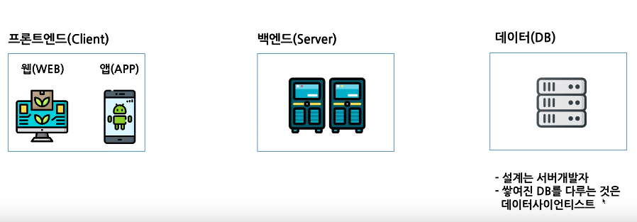
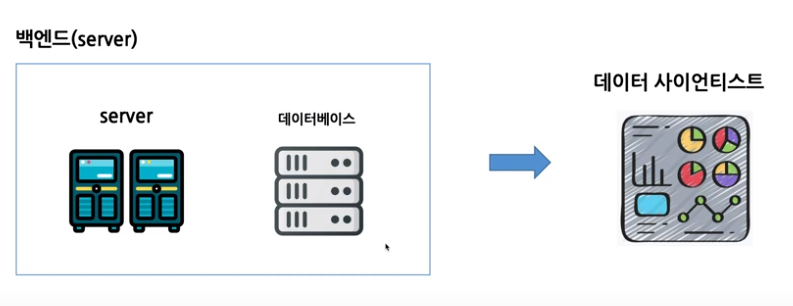
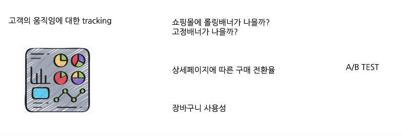
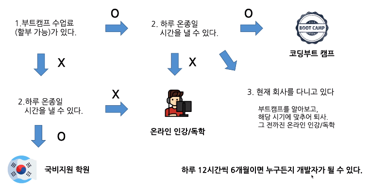
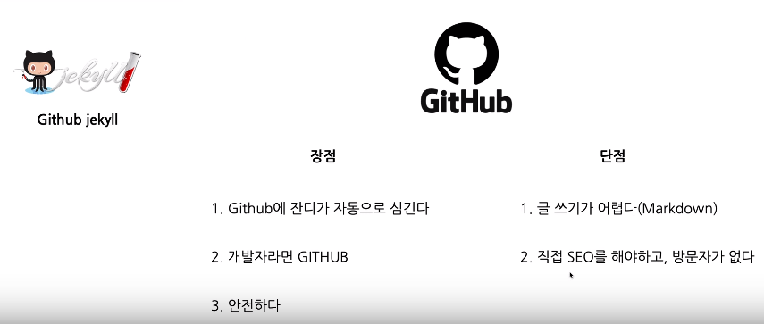

꿈이 없는 놈 꿈만 꾸는 놈 꿈을 이루는 놈

직업으로서 개발자를 경험

1. 내가 개발을 시작하려는 이유 명확히 하기 => 각각의 관심도에 맞는 개발 공부 방향 제시
2. 개발 분야 정하기 => 개발자 커리어를 시작하기에 앞서 선택할 수 있는 개발 분야 확인, 선택
3. 공부 방법 선택 => 국비지원 / 코딩부트캠프 / 온라인교육 / 독학
4. 개발 언어 선택 => 개발자 입문 위한 주특기 언어 선택
5. 개발자 취업 준비 => 실제 개발자 취업을 위해 준비해야 할 것들과 준비 방법
6. 회사 지원 => 개발자로  첫 회사 선택 방법
7. 입사 그 이후 => 실제 개발자로서의 삶과, 입사 선공을 위한 꿀팁들

### 내가 개발을 시작하려는 이유

각각의 관심도에 맞는 개발 공부 방향 제시

1. 워낙 주변에서 소프트웨어 이야기를 많이 해서 관심이 간다(4차 산업 혁멍, 알파고 등)

   더 많은 소프트웨어 책을 읽어본다

   '더 나은 세상을 위한 소프트디지털'

   '인문학도 개발자되다'

   '점프 투 파이썬' 간단한 개발 기본 문법 학습

2. 소프트웨어적으로 무언가 만들어보고 싶은 것이 생김(사업 아이템, 클론 코딩)

   아마존, 인스타그램, 페이스북...

   실현 가능한 것인가?

   직접 구현할 수 있는 것인가? / 규모는 어느정도?

   프레임워크(framework)에 대한 공부 <= [Programming language => framework => Service]

3. 개발이라는 것에 관심이 생겼고, 실제로 개발자를 해보고 싶다(개발자로 전향)

   '소프트웨어 장인'

   '생활코딩'

### 개발 분야 정하기

분야에 따라서 해야하는 공부 달라짐

1. (html/css를 활용해) 앞에 화면을 하나 하나 만든다.
2. 아이디 중복 체크 / 비밀번호 재확인 / 이름 띄어쓰기, 특수문자 / 이메일 양식 확인 / 인증번호 확인 => 다 맞으면 DB에 저장

Client <=> 프론트엔드 <=> Server <=> 백엔드 <=> DB(데이터베이스)

프론트엔드 : 클라이언트 개발 & 서버에 어떻게 요청 보내는지 

백엔드 : 서버 만들고 데이터베이스에 자료를 어떻게 넣을지 설계

웹(Web) 앱(App) 데이터사이언티스트

프론트엔드 개발자

* 웹프론트엔드 개발자

  1. 웹사이트의 Client단을 만드는 사람들

  2. 신입개발자로 시작하기 좋으며, 신입개발자 많이 뽑음
  3. 취업 빠르고(3개월), 대부분 부트캠프 교육 과정
  4. 웹에 관심이 있으며, 바로 바로 결과물이 눈에 보이는 것을 좋아함
  5. 처음 커리어 시작으로 적합

* 앱프론트엔드 개발자
  1. 앱의 Client단을 만드는 사람들
  2. 신입개발자로 시작하기 나쁘지 않음
  3. 취업이 빠르고(빠르면 4~6개월), 몇 몇 교육과정들이 있다
  4. 안드로이드, IOS로 나뉘며, IOS개발을 위해서는 맥북 필요
  5. 웹보다는 앱에 관심이 있다

백엔드 개발자

1. 이용하는 서비스의 뒷부분 만드는 사람들
2. 하나의 서버를 바탕으로 웹, 앱 2개의 서비스 운영 가능
3. 전체적인 로직처리 및 데이터베이스를 설계
4. 취업이 어렵다(신입 개발자) 최소 6개월
5. 화면에 나오는 부분보다 로직 구성에 더 흥미를 느끼는 사람

* 코드리뷰 : 다른 개발자들이 개발한 코드에 이상이 없는지 있는지 체크

데이터 사이언티스트

1. 고객의 움직임에 대해 예측하고, 필요한 데이터를 뽑아낸다
2. 개발팀에 속해 있으나, 보통 마케팅팀과 협업하며 일한다
3. 데이터베이스에 쌓여 있는 데이터를 활용 가능한 데이터로 만든다
4. 데이터에 관심이 많으며, 데이터에 흥미를 느끼는 사람
5. 빅데이터의 중요성이 높아지며, 대부분의 회사에서 뽑기를 희망. 3~6개월

기타 개발 직군

* 풀스택 개발자
* 딥러닝/머신러닝 개발자
* 게임 개발자
* 인프라 개발자
* 데스크탑 네이티브
* 임베디드 개발자

### 공부 방법 선택

각 분야에 대한 커리큘럼 어떻게 공부할 것인가

* 국비지원 학원

  1. 국가에서 지정한 교육기관에서 교육 진행
  2. 전액 무료(대부분), 매달 40만원 돈 받음
  3. 교육 질 떨어질 수 있으므로 잘 선택
  4. 함께 학습하는 사람들의 열정이 그만큼 낮을 수 있다
  5. 분야를 선택할 수 있지만 대부분 JAVA만을 배우다가 끝남

  => 시간 많으나 돈 제약 있는 사람. 검증된 곳에서 진행

  HRD(국비 지원 교육 안내)

  Okky(개발 관련 커뮤니티)

* 코딩부트 캠프

  1. 단기간에 체계적인 교육으로 개발자를 양성
  2. 교육의 질이 높고, 학생들의 열정도 높다
  3. 취업이 연계되어 있는 경우가 많다. 따라서 바로 취업도 가능 => 국비와의 차이
  4. 가격이 높다. 3~6개월
  5. 기존 학원과는 다르다 => 자기 주도적 학습

  => 시간, 돈 여유 있는 사람. 가장 빠르고 확실하게 개발자가 될 수 있음(단, 본인에게 적합한 부트캠프 선택)

  1. 본인이 선택한 분야에 맞는 부트캠프(소프트웨어 개발자라는 말에 속지 않는다) 가야함
  2. 개강 시기를 잘 맞추지 않으면 가고 싶어도 갈 수 없음
  3. 본인과 잘 맞지 않는 부트캠프를 가면, 시간과 돈 모두 잃음
  4. 혼자서는 알아보기 힘들다

  * 코드스테이츠 <- Win-Win제도 운영(연봉 17% 2년 납입 조건으로 수업 들을 수 있음). 주로 웹프론트엔드 과정 + 백엔드. Pre과정(2개월) 수료 후 + 3개월 Immersive. 취업 잘 시킴
  * 코드스쿼드 <- 수업 진행 전 코딩테스트. STEP23을 통해 각 STEP별로 과제 통과. 3명의 멘토, 웹프론트, 서버, IOS로 진행. 매달 90만원
  * 위코드 <- Wework에서 3개월간 집중 학습. 상시 튜터들이 대기(멘탈 케어). 웹프론트, 서버 2개 과정
  * 패스트캠퍼스 스쿨 <- 12개월 무이자 할부 지원. 초보자에게 적합(매일 4시간씩 수업). 프론트/서버/IOS/데이터사이언티스
  * 바닐라코딩 <- 수업 진행 전 면접. 실리콘밸리 개발자 하드캐리. 취업까지 도와줌
  * 스파르타코딩클럽 <- 취미로 개발을 해보자. 퇴근 이후 3시간씩 혹은 주말 6시간. 8주 과정. 5주간 기본 개념. 3주간 프로젝트

* 온라인 인강 / 독학

  1. 교육 질 높고, 가격 저렴(ex. Udemy의 Complete Python Bootcamp)
  2. 시간 자유 사용
  3. 본인이 확실하게 관리할 수 있어야 함
  4. 인프런, 네이버 부트스타트, Udemy, 생활코딩

  => 자기 관리 잘하고 하루 종일 시간 내기 어려운 사람. 비용 적게 들고 일과 병행 가능

1. 하루에 내가 개발 공부에 낼 수 있는 시간?
2. 현재 나에게 있는 금액

### 개발 언어 선택하기

선택권 많이 없음. 무언가를 하고 싶은 게 있다면 반드시 해야 할 언어들

JavaScript : 요즘 가장 핫한 언어. 프론트/서버/앱까지 모두 가능

Python : 데이터, 딥러닝, 머신러닝, 서버 구현가능

Java : 공식 지정 언어/가장 많은 일자리. 서버/앱 가능

C언어 : 가장 기본이 되는 언어. 게임/임베디드

SWIFT :  IOS앱 개발을 위한 언어

https://www.tiobe.com/tiobe-index/

무슨 언어 공부할지 모르겠다 => 자바스크립트

데이터/딥러닝/머신러닝 => 파이썬

처음 입사를 위한 주특기 언어 한 개를 선택하는 것

### 개발자 취업을 위한 준비

개발자로 이력서를 넣어야 하는데, 무엇을 보여줄 수 있을까?

https://deaguowl.github.io

Portfolio <- 안에 구성할 컨텐츠

Blog Youtube 개인 프로젝트

Blog

1. 개발자로서 굉장히 중요한 자질 : 꾸준함/성장/TIL

2. 꾸준한 성장을 강조하기 위해 개발 블로그는 꼭 해야 한다

   Github jekyll / Tistory

   GitHub <- 개발한 것에 대해 온라인에 올려놓을 수 있는 플랫폼. 잔디 심기 <- 깃헙 블로그하면 자동 잔디 심기 됨

   포기할 것 : 쉽게 글 적기, 방문자수..

   

   티스토리 <- 글 쓰기 쉽고 방문자가 오고 개발자들이 많이 쓴다

   하루라도 빨리 시작하기(1일 1블로그)

   

Youtube

1. 필수는 아니지만, 개발자로서의 성장을 위해 하는 것을 추천

   온라인 강의/교재 -> 복습 -> 블로그 -> 유튜브

   1. 화면 녹화 통해 금방 컨텐츠 만들 수 있다
   2. 시간 대비 얻는 효율이 엄청 나다
   3. 블로그는 누구나 하지만, 유튜브까지 하면 그 때부터 확실히 차이가 나게 된다
   4. 매일 10분 ~ 20분 혹은 주에 1회 1시간 촬영. 그것을 위해 블로그를 매일 매일 잘 해놔야 함

선순환 구조 1일 1블로그 잘 해놓으면 유튜브 촬영 쉬워짐

개인 프로젝트

1. 최소 2개 이상의 개인 프로젝트를 진행 + 커리큘럼 따라가며 프로젝트 2개 => 4개
2. 이 부분에서 시간 차이가 제일 많이 난다

기본 프로젝트 하기 전 진행 과정

Programming language(2개월) -> framework(2개월) -> Service(2개월)

2개월 시간 앞당기기

프로그래밍 언어 2개월 투자 후 2개월간은 프레임워크 배우면서 서비스 같이 만들기

1. 프레임워크를 배우는 것과 동시에 프로젝트를 진행(2달간 2개의 프로젝트 진행)
2. 이것을 위해서 무엇을 해야 하나

Programming language 2개월 <- 기획 먼저 해놓기. 구체적으로 눈에 보이는 기획

Adobe XD <- 서비스를 화면에 기획

언어를 배울 때 2개의 기획을 해놓고 프레임워크를 배울 때 함께 개발 진행

Portfolio

1. 포트폴리오는 나를 가장 먼저 나타내는 매개체
2. 웹사이트 제출

* 기존에 있던 테마를 활용하여 포트폴리오를 제작하면 됨

  [Jekyll Themes | Modern Resume](http://themes.jekyllrc.org/modern-resume/)

  [Resume - Theme Preview - Start Bootstrap](https://startbootstrap.com/previews/resume/)

  [Colorlib | Free Bootstrap Website Template](https://colorlib.com/preview/#elen)

  [Colorlib | Free Bootstrap Website Template](https://colorlib.com/preview/#jackson)

* 미리 조금씩 시간 내서 포트폴리오 만들어 가고 주말 이틀 정도 투자. 개발자 포트폴리오 < 일단 본인에 대해 정리

* 다 만든 이후 Github hosting 통해 누구든지 접속 가능하게 만들기(웹 호스팅(github pages) - 생활코딩)

### 개발자로 회사 지원하기

회사 지원하며 알아야 하는 것들

사실 취업이 생각보다 쉽진 않다 좋은 회사라면 더 그러하다

회사에서 신입을 뽑을 때 보는 것 : 

Performance(신입에서 많은 것 바라진 않음. 경력X, 짧은 시간 파악 불가, 포트폴리오)

#### Personality(함께 일하기 좋은 개발자 : 소통)

왜 개발을 시작했는지? 준비(디지털 노마드 이런거 X)

본인만의 기준 세우기

연봉 : 최소 ~만원 이상의 연봉을 받고 싶다 - 본인 실력에 맞는 연봉 찾기. 크레딧잡

개발문화 : 개발팀의 분위기 / 코드 리뷰는 진행하는가 - 함께 일하는 곳의 분위기에 따라 본인 성장에 영향. 구글링/잡플래닛

좋은 사수 : 첫 사수 굉장히 중요 - 혼자 진행 해야하는지, 사수분이 있는지. 면접 때 질문

워라벨 : 집에서의 거리, 야근. 잡플래닛 후기, 개발자에 대한 중요도 상승/워라벨 중시

기준 맞으면 일단 바로 가기

회사 알아보기

* 로켓펀치(10~20명 규모의 스타트업)

  [로켓펀치 - 비즈니스 네트워크](https://www.rocketpunch.com/)

* 사람인(어느 회사든 이용하는 채용 사이트)

  [사람인](https://www.saramin.co.kr/)

* 원티드(경력직 전문 이직 사이트)

  [원티드 - 지인 추천하고 보상금 받기](https://www.wanted.co.kr/)

### 입사 그 이후

유지 보수 대부분 -> 회의감 -> 시간 지나고 업무 맡겨지고 회사에서 내가 만든 기능들 점점 많이 써서 기분 좋음

낮지 않은 연봉 + 실력 된다면, 연봉 상승률 좋고 지속적으로 성장하며 일 해나갈 수 있고 대신 거기에 맞춰 책임감이 많이 따름

성장하며 일을 주도적으로 하고 있다는 생각을 느낄 수 있어서 좋음

굉장히 만족, 추천