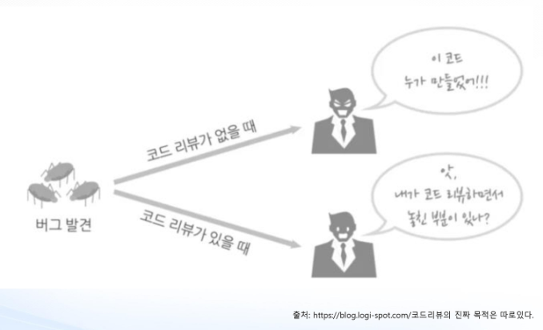

클린코드 : 깔끔한 코드 작성하자

WTF/1분 mim

깨끗한 코드는 한 가지를 제대로 한다. - 비야네 스트롭스트룹 -

의도 분명. 깨끗하고 이해하기 쉬운 코드.

깨끗한 코드는 단순하고 직접적이다. 잘 쓴 문장처럼 읽힌다. - 그래디 부치 -

깨끗한 코드에는 의미 있는 이름이 붙는다. 특정 목적을 달성하는 방법은 하나만 제공. 코드는 문학적으로 표현해야 마땅. - 큰 데이브 토마스 -

깨끗한 코드는 언제나 누군가 주의 깊게 짰다는 느낌을 준다. 고치려고 살펴봐도 딱히 손 댈 곳이 없다. - 마이클 페더즈 -

중복 줄이기, 표현력 높이기, 초반부터 간단한 추상화 고려하기. - 론 제프리 -

읽기 쉬운 코드

생각하는 대로 읽히고 작동하는 코드 - 워드 커닝엄 -


나쁜 코드

르블랑의 법칙 나중은 없다.

10 : 1 = 코드를 읽는 시간 : 코드를 짜는 시간


클린코드의 주요원칙

Follow Standard Convention

Keep it simple, Stupid

Boy Scout Rule

Root Cause Analysis

Do not multiple language in one source file


클린코드의 주요원칙(Class Design) - 간단함을 유지 SOLID

하나의 클래스는 하나의 책임만 가져야 한다

클래스는 확장에 대해 열려 있어야 하고, 변경에 대해서는 닫혀있어야 한다.

파생클래스의 메소드는 기반 클래스의 메서드를 대체하여 사용될 수 있어야 한다.

클라이언트가 사용하지 않는 메소드에 의존하지 않아야 한다.

추상화된 것은 구체적인 것에 의존하면 안된다


의미있는 이름

명확하고 간결하게 주석달기. 주석이 없다고 가정하고 코드 짜기(구체적)

보기좋게 배치하고 꾸미기

읽기 쉽게 흐름제어 만들기


착한 함수 - 논리 한가지, 가급적 작게, 한번에 하나의 작업만 수행하도록 작성


레거시 코드(push 한 후) 다루기

코드리뷰

프레임워크 <- 생산성. 규칙 통일. 더 빠른 아웃풋. 협업 용이




참고 : 

https://edykim.com/ko/post/tech-has-a-toxic-tone-problem-lets-fix-it/


리팩토링 : 소프트웨어를 보다 쉽게 이해할 수 있고, 적은 비용으로 수정할 수 있도록 겉으로 보이는 동작의 변화 없이 내부 구조를 변경하는 것

컴퓨터가 인식가능한 코드는 바보라도 작성할 수 있지만, 인간이 이해할 수 있는 코드는 실력있는 프로그래머만 작성할 수 있다.

코드를 처음부터 다시 작성할 때, 마감일에 가까울 때는 리팩토링 X


코드스멜

Bloaters

Object-Orientation Abusers

Change Preventers

Dispensables

Couplers


뱅크샐러드

01 야생 개발자

야생? 산이나 들에서 저절로 나서 자람. 또는 그런

Wild


협업 경험이 적은 문과 출신 개발자

프로그래밍, 제법 문과스러움. 시 쓰듯 프로그래밍.

멋진 코드는 함축적인 코드?

우아한 코드는 적당히 어려운 코드?

...

협업을 위한 코드? 

02 담대한 협업

경쟁에서 최고의 무기는 '협업'

공유와 피드백

냄맡빠공

냄새를

맡으면

빠르게

공유


코드 리뷰를 잘하는 것

협업하기 좋은 코드 리뷰하기 좋은 코드

클린 코드 책


03 클린 코드

깨끗한 코드 "깨끗한 코드는 잘 쓴 문장처럼 읽힌다"

의미있는 이름 "의도를 분명하게 밝혀라"

함수와 주석

함수 "프로그래밍은 여느 글짓기와 비슷하다"

주석 "주석 쓰기 시작하면 코드 가독성 떨어지므로 주석 대신 코드로 이야기"

서술적인 이름

오류 처리

"논리와 오류 코드를 뒤섞지 마라"

비즈니스 로직(사용자에게 영향을 주는 코드)에 집중할 수 있게 해라

논리와 로깅 코드를 뒤섞지 마라

로깅 코드가 숨어들어서 논리에 집중X

로깅 코드 분리 -> 논리 집중


04 뱅샐 개발자

Lint

ESLint

.github 폴더 - codeowners

```
* @seolyucode
```


pull request template md

.github - pull_request_templates.md

```
## 요구 사항
## 수정 사항
## 확인이 필요한 지점
```

