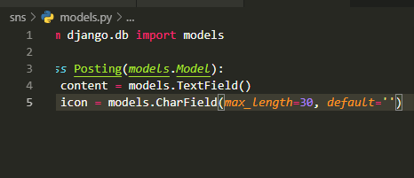

03_LIMAGE_UPLOAD

py -m venv venv

F1 - select interpreter - venv venv

(venv)

`pip install django django-extensions ipython`

`python -m pip install --upgrade pip`


`django-admin startproject image_upload .`

`git add .`

`git commit -m 'Init project'`


Static File (정적 파일) => JavaScript CSS IMAGE 서버에서 제공하려고 준비해놓는 파일.(고정)


`django-admin startapp sns`

settings.py 33번째 줄에  'sns', 추가 / 위에다가 'django_extensions', 추가

LANGUAGE_CODE = 'ko-kr'

맨 밑에 보면

```python
STATIC_URL = '/static/'
# STATIC_URL = 'edit/'  # 이렇게 하면 수정할 수 있지만 나중에 재할당하지 않기
```

urls.py에 가서 include 추가하고 path('', include('sns.urls')),

```python
from django.contrib import admin
from django.urls import path, include

urlpatterns = [
    path('admin/', admin.site.urls),
    path('', include('sns.urls')),   # sns.urls로 포워딩
]
```


앱으로 가기 

`cd sns`

`mkdir -p templates/sns`

-p는 한번에 없는 것들 만들 때 씀

`touch urls.py forms.py`

`cd templates/sns/`

`touch base.html posting_list.html posting_detail.html`


`python manage.py runserver` 해보면

sns에 urls.py에 패턴이 없어서 에러남

```python
from django.urls import path
from . import views

app_name = 'sns'

urlpatterns = [

]
```


models.py에 모델 생성

```python
from django.db import models

class Posting(models.Model):
    content = models.TextField()
```

`python manage.py makemigrations sns`

견적서 만듦


models.py

```python
from django.db import models

class Posting(models.Model):
    content = models.TextField()
    icon = models.CharField(max_length=30)
```

`python manage.py makemigrations sns`

...

2누르고 엔터

```python
icon = models.CharField(max_length=30, default='')
```

default='' 쓰고

`python manage.py makemigrations sns`

```python
class Posting(models.Model):
    content = models.TextField()
    icon = models.CharField(max_length=30, default='')
    view_count = models.IntegerField()
```

`python manage.py makemigrations sns`

아까와 똑같은 문제

1 엔터치면 python interpreter 나옴

0 누르고 엔터치면 됨 <- 이렇게 하면 안됨(다른 사람이 코드 봤을 때 migration파일에는 디폴트 0 써있지만 models.py 코드 봐서는 default 없는 줄 아니까)


`python manage.py migrate sns`

db.sqlite3 오픈 데이터베이스

sns_posting 재생


models.py에 view_count 지우기

```python
from django.db import models

class Posting(models.Model):
    content = models.TextField()
    icon = models.CharField(max_length=30, default='')
```

`python manage.py makemigrations sns`

`python manage.py migrate sns`


테이블 지우려면 주석처리하고

```python
from django.db import models

# class Posting(models.Model):
#     content = models.TextField()
#     icon = models.CharField(max_length=30, default='')
```

`python manage.py makemigrations sns`

`python manage.py migrate sns`

```python
from django.db import models

class Posting(models.Model):
    content = models.TextField()
    icon = models.CharField(max_length=30, default='')
```

주석 없애고

`python manage.py makemigrations sns`

`python manage.py migrate sns`

비어있는 테이블 다시 생성



* 캡쳐

  Window + Shift + s

  Ctrl + v

  TIL - memo - images폴더 만들고 위치 복붙(캡쳐 이미지 주소에)

  (Ctrl + F해서 나중에 일괄 변경)

  ./images/이름 


models.py

```python
from django.db import models

"""
$ python manage.py migrate <APP_NAME> zero
"""

class Posting(models.Model):
    content = models.TextField()
    icon = models.CharField(max_length=30, default='')
```

`python manage.py migrate sns zero `<- 역순으로 unapplying

`python manage.py migrate sns` <- 순서대로 applying


`rm sns/migrations/0*`


models.py - created_at, updated_at 추가

```python
class Posting(models.Model):
    content = models.TextField()
    icon = models.CharField(max_length=30, default='')
    image = models.ImageField(blank=True)  # 이미지는 비울 수도 있다
    created_at = models.DateTimeField(auto_now_add=True)  # 추가될 때만 / add 될 때 / 고정 
    updated_at = models.DateTimeField(auto_now=True)  # 수정, save 할 때마다 
```

blank=False  <- 비울 수도 있다

null=False


`python manage.py makemigrations sns`

`pip install pillow`

`python manage.py makemigrations sns`


models.py

```python
from django.db import models

"""
$ python manage.py migrate <APP_NAME> zero
$ rm <APP_NAME>/migrations/0*
"""

class Posting(models.Model):
    content = models.TextField()
    icon = models.CharField(max_length=30, default='')
    image = models.ImageField(blank=True)  # 이미지는 비울 수도 있다
    created_at = models.DateTimeField(auto_now_add=True)  # 추가될 때만 / add 될 때 / 고정 
    updated_at = models.DateTimeField(auto_now=True)  # 수정, save 할 때마다

    # Detail 페이지를 쓸 거라면 만들어요.
    def get_absolute_url(self):
        return reverse("model_detail", kwargs={"pk": self.pk})  # id랑 pk 같은 말
    
```


urls.py

```python
from django.urls import path
from . import views

app_name = 'sns'

urlpatterns = [
    path('newsfeed', views.posting_list, name='posting_list'),
    path('postings/<int:posting_id>/', views.posting_detail, name='posting_detail')
]
```


models.py - 수정

```python
# Detail 페이지를 쓸 거라면 만들어요.
    def get_absolute_url(self):
        return reverse("sns:posting_detail", kwargs={"posting_id": self.pk})

    def __str__(self):
        pass
```


admin.py에 가서

```python
from django.contrib import admin
from .models import Posting

class PostingModelAdmin(admin.ModelAdmin):
    pass

admin.site.register(Posting)
```


views.py

```python
from django.shortcuts import render, redirect, get_object_or_404
from django.views.decorators.http import require_GET, require_POST

from .models import Posting

def posting_list(request):
    return render(request, 'sns/posting_list.html', {

    })

def posting_detail(request, posting_id):
    return render(request, 'sns/posting_detail.html', {

    })
```

`python manage.py migrate`


```
$ python manage.py makemigrations  <- 전체 다
$ python manage.py makemigrations <APP_NAME>
```


'django.contrib.auth',  # authenticate 인증


`python manage.py migrate`

`python manage.py createsuperuser`


`python manage.py migrate <APP_NAME> zero` <- 떼는건 다 안되고 앱이름 써야함


`python manage.py runserver`


http://127.0.0.1:8000/admin/

admin.py에 admin.site.register(Posting) 있어야 함


에러에

Request information


models.py에 def__str__(self): 주석처리 하면 그림 저장됨


models.py

```python
    def __str__(self):
        return f'{self.pk}: {self.content[:10]}'
```


admin.py

```python
from django.contrib import admin
from .models import Posting

class PostingModelAdmin(admin.ModelAdmin):
    readonly_fields = ('created_at', 'updated_at',)

admin.site.register(Posting, PostingModelAdmin)
```


구글

django admin site list


admin.py

```python
class PostingModelAdmin(admin.ModelAdmin):
    readonly_fields = ('created_at', 'updated_at',)
    list_display = ('id', 'content', 'created_at', 'updated_at')
    list_display_links = ('id', 'content')
```


views.py

```python
@require_GET
def posting_list(request):
    postings = Posting.objects.all()
    return render(request, 'sns/posting_list.html', {
        'postings': postings,
    })

@require_GET
def posting_detail(request, posting_id):
    posting = get_object_or_404(Posting, id=posting_id)
    return render(request, 'sns/posting_detail.html', {
        'posting': posting,
    })
```

