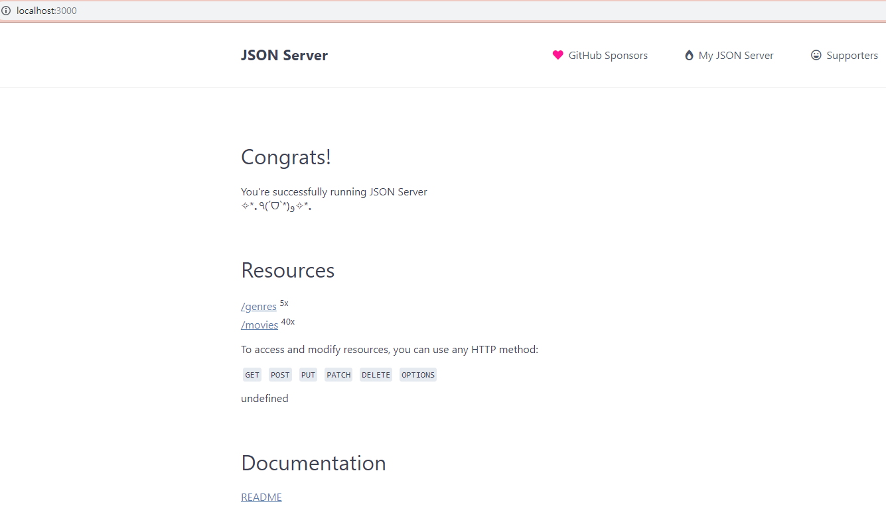

```javascript
const laptop = {
    model: 'macbook',
    year: 2019,
    inch: 15,
}
```

```javascript
const model = laptop.model
```

```javascript
const { model } = laptop;
```

```javascript
const { model, year, inch } = laptop
```

...


pjt09/movie

`npm i`

`npm i -g json-server`

`json-server`


db.json 위치(pjt09)에서 git bash here

`json-server db.json`

 http://localhost:3000/ 




 http://localhost:3000/genres 

 http://localhost:3000/genres/1  <- 1번 장르만 나옴

 http://localhost:3000/movies

 http://localhost:3000/movies/10

 

포스트맨에서

GET  http://localhost:3000/movies 

 http://localhost:3000/movies/

POST  http://localhost:3000/genres/ 

Body - raw JSON - 

```
{
	"name": "미스테리"
}
```

Ctrl + Enter

 http://localhost:3000/genres/7 

```
{
	"name": "Horror"
}
```


movie-